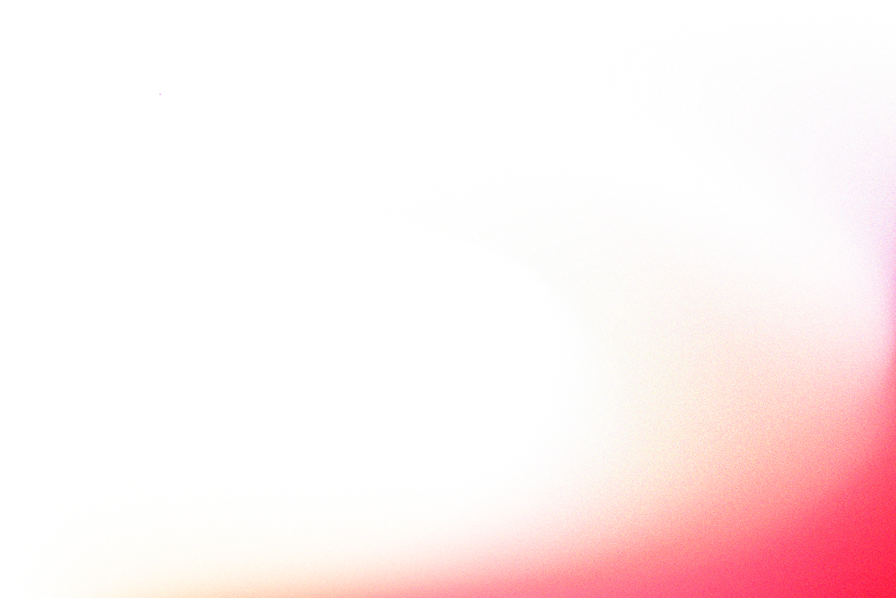

# Rimac CoE — Editorial Slides · `DESIGN.md` (v2)

> **Filosofía en una línea:** un **marco uniforme y serio** + **una idea por slide** + un **corazón libre** que la explica con la mejor visualización posible. La variedad se mide en **calidad de la idea**, no en novedad de formato.

## Overview

**Corporate clarity meets idea-first storytelling.** Decks 16:9 del CoE Diseño Estratégico de Rimac: marco consistente y sobrio (lo que los hace "de la casa"), y un corazón donde cada idea recibe la visualización que mejor la explica. Tono corporativo, inspirador, riguroso — no creativo-publicitario.

Este `DESIGN.md` trabaja en **tres capas** (ver token `layers`):

| Capa | Estado | Qué define |
|---|---|---|
| **1 · Marco** | 🔒 Bloqueado (uniforme) | Título (franja superior, color/tipografía/voz fijos), footer + branding siempre, paleta disciplinada, estética plano-seria, stage y motion. |
| **2 · Una idea por slide** | 🔒 Regla de contenido | Cada slide transmite **un único mensaje**, sintetizado en el título. Sin slides "cajón de sastre". |
| **3 · Corazón** | 🆓 Libre — aquí vive la calidad | Cómo se **visualiza y narra** esa idea: texto, mixto, diagrama, dato o visual; con animación y recursos gráficos a medida. |

**Cómo leer este documento.** Los **tokens** (front matter) son la única ley máquina-legible. La **prosa** explica *por qué* existen y *cómo* aplicarlos. El skill `frontend-slides` lee este archivo como contexto: **la rúbrica y los guardrails viven aquí; el skill los ejecuta** contra el contenido real de cada deck.

> **Regla de oro:** la uniformidad del marco es un **activo**, no un límite — es lo que da marca y seriedad. No busques variedad cambiando el formato; búscala **elevando la calidad con que el corazón explica cada idea.** Dos slides con marco idéntico pueden ser excelentes y distintos porque su idea, y su visualización, lo son.

## Colors

Neutros de alto contraste + un único rojo de marca como motor de énfasis. Lavanda y soft-tones para respiro y profundidad tonal. **La paleta es disciplinada: no se "juega" con colores para dar variedad.**

| Token | Hex | Uso |
|---|---|---|
| `primary` | `#0B1620` | Titulares, eyebrows. Tinta profunda; no diluir. |
| `text` | `#1F2937` | Cuerpo. Un paso más suave que `primary`. |
| `secondary` | `#6B7280` | Footer-tag, pagenum, captions, anotaciones. |
| `tertiary` | `#F7052D` | **Rojo Rimac.** Logo, acentos, celda enfática. Nunca sobre cuerpo. |
| `neutral` | `#FFFFFF` | Fondo de slide por defecto; texto sobre fondo oscuro. |
| `accent-orange` / `accent-magenta` | `#FF7A00` / `#C8128B` | Extremos del gradiente; standalone en datos. |
| `bg-section` | `#ECEEFC` | Lavanda: section dividers y respiros del blanco. |
| `bg-soft` / `bg-warm-soft` / `bg-cool-soft` | `#F5F6FB` / `#FFF6EF` / `#F7F8FE` | Contenedores planos; el par cálido/frío para comparativas. |
| `line` | `#E5E7EB` | Bordes y divisores. |

**Énfasis — dos gestos oficiales, ambos sobre UNA frase clave por título:** (1) gradiente `hero` (token `gradients.hero`) vía `background-clip:text`; (2) rojo sólido (`tertiary`, componente `emphasis-solid`). Un gesto por slide como máximo, opcional; **no en todos los slides.** El énfasis es de marca, no un recurso de variedad.

## Typography

Dos familias: **BRSonoma** (todo el sistema) y **Rimac Display** (exclusivo del título de portada).

**Carga correcta — opción B (una familia por peso).** `BRSonoma` **no está en Google Fonts**: se carga desde los `.ttf` locales. Cada peso es **su propia familia** (`BRSonoma Bold`, `BRSonoma Medium`…), así se usa el archivo real horneado y nunca un peso sintético ("faux weight").

```css
@font-face{ font-family:'BRSonoma Light';    src:url('./assets/fonts/BRSonoma-Light.ttf')    format('truetype'); font-display:swap; }
@font-face{ font-family:'BRSonoma Regular';  src:url('./assets/fonts/BRSonoma-Regular.ttf')  format('truetype'); font-display:swap; }
@font-face{ font-family:'BRSonoma Medium';   src:url('./assets/fonts/BRSonoma-Medium.ttf')   format('truetype'); font-display:swap; }
@font-face{ font-family:'BRSonoma SemiBold'; src:url('./assets/fonts/BRSonoma-SemiBold.ttf') format('truetype'); font-display:swap; }
@font-face{ font-family:'BRSonoma Bold';     src:url('./assets/fonts/BRSonoma-Bold.ttf')     format('truetype'); font-display:swap; }
@font-face{ font-family:'BRSonoma Black';    src:url('./assets/fonts/BRSonoma-Black.ttf')    format('truetype'); font-display:swap; }
@font-face{ font-family:'Rimac Display';     src:url('./assets/fonts/Rimac-Display.ttf')     format('truetype'); font-display:swap; }

/* Cada familia ES un peso → no se setea font-weight. font-synthesis:none impide
   que el navegador invente pesos o itálicas si algún archivo no cargó. */
html,body{ font-family:'BRSonoma Regular','Helvetica Neue',Helvetica,Arial,sans-serif; font-synthesis:none; }
```

**Roles (bloqueados):**

- `Rimac Display` → **solo** `cover-title`. Jamás en otro lugar.
- `BRSonoma` → todo lo demás. La escala usa **Regular** (cuerpo), **Medium** (lead, footer) y **Bold** (titulares, sub-titulares, tier-tags). Las otras familias cargadas (Light, SemiBold, Black) están disponibles si una idea las pide; no se sintetizan pesos.
- El `fontSize` puntual es libre dentro del rango anotado: `h2` **56–96px** según el largo. `tier-tag` / `eyebrow` van **uppercase** (`text-transform` en CSS).

### Voz del título — corporativa de síntesis (bloqueada)

El título es lo más uniforme del sistema. Su **redacción** sigue una voz fija; su **forma** admite variación controlada.

- **Síntesis de la idea** del slide: condensa el mensaje, no lo rotula.
- **Sin punto final.**
- **Potente, corporativo e inspirador — no "creativo"**: sin juegos de palabras ni tono publicitario.
- Sin siglas. Negrita (Bold) en el verbo/sustantivo clave si aporta.

| ✅ Voz corporativa de síntesis | ❌ Etiqueta / ❌ Creativo-publicitario |
|---|---|
| La velocidad no es la meta, sino descubrir el error a tiempo | "Velocidad" · "Rápido y furioso, edición CoE" |
| El cuello de botella ya no es construir, es decidir | "Sobre el proceso" |

**Variación controlada de la forma del título:** se mantiene fijo el **color, la tipografía, la voz y la franja superior** donde vive; pueden variar la **alineación** (izquierda o ancho) y **una o dos líneas**. Nunca flota fuera de la franja superior ni cambia de color/tipografía.

**Un solo encabezado — sin label/eyebrow encima (bloqueado).** El slide encabeza con **un único título**, nunca un encabezado "en dos tiempos": **no se pone un eyebrow ni un label gris encima del título.** En slides de **manifiesto o declaración**, la frase grande **ES** el título — no se le agrega otro título ni un label arriba.

## Layout

El marco fija dónde van título y footer; el **corazón** es el espacio entre ambos, y es libre.

**Stage (bloqueado).** Token `stage`: **1920×1080**, escalado uniforme con `transform: scale()`. `flex-shrink:0` + `min-width/height` en `.stage`. Padding `80px 100px 100px`. Conmutar slides con `visibility + opacity + pointer-events`; **nunca `display:none`**. Patrón en `proof-rimac.html`.

**Escala de espaciado (bloqueada).** Token `spacing` (`xs 4` → `3xl 100`). Mantener ritmo con la escala; no valores arbitrarios.

**El corazón y el marco.** El **título** va en la franja superior (variación controlada, §Typography) y el **footer** abajo-izquierda — ambos **siempre presentes, como capas persistentes**. El corazón vive entre ellos y puede:

- **centrarse** (`.slide-body { margin:auto 0 }`) cuando es contenido ligero (texto, un dato), o
- **expandirse a todo el lienzo** (un diagrama, una visualización, una foto) con título y footer **por encima** como overlays.

> Mecánica del centrado: `.slide.content` es flex column **sin `justify-content`** → el título queda anclado arriba; `.slide-body` (inyectado por JS, recoge lo que va entre el título y el footer) se centra con `margin:auto 0`. Los grids **no llevan `flex:1`**. Para corazón a lienzo completo, el visual se posiciona absoluto bajo título/footer.

### El corazón del slide — tratamiento adaptativo (la rúbrica)

El corazón **no siempre es visual.** El skill evalúa la **naturaleza de la idea** y elige el tratamiento. El `DESIGN.md` define el *menú* y *cuándo*; el skill decide *para este contenido*.

| Naturaleza de la idea | Tratamiento del corazón |
|---|---|
| Relación, proceso, comparación, cantidad, flujo, jerarquía | **Visual / diagrama / dato** (animado) |
| Idea con 2–4 partes, o un antes→después | **Mixto** (texto + visual de apoyo) |
| Matiz, principio, definición, cita, tesis | **Texto-líder** (tipografía protagonista) |

**Reglas transversales del corazón:**

- **Una idea por slide.** Si hay dos ideas, son dos slides.
- **Nunca default-ear a viñetas.** Las listas son el último recurso, no el primero.
- **El visual explica, no decora.** Si un gráfico no aclara la idea mejor que el texto, no va.
- **Animar para revelar el argumento** (build-up por pasos), no por adorno. Cada elemento entra con `.reveal`; respetar `prefers-reduced-motion`.
- **El motion se elige por intención, no por regla.** Cada intención tiene su técnica (resaltar → barrido de gradiente o subrayado que se dibuja; un dato → count-up; crecimiento/relación → draw-on SVG; revelar → wipe; atmósfera en oscuro → fondo-viñeta + grano/partículas). El skill lee la idea, **propone** la técnica y respeta su límite — **no hay catálogo cerrado ni checklist**; las técnicas nuevas se proponen o se hacen **a pedido**. Los recursos de profundidad permitidos (con su límite) están en §Elevation y en `animation-patterns.md`.

> **Variedad = calidad, no formato.** No se fuerza que cada slide tenga un layout distinto, ni rotación de colores o tonos. Marcos repetidos están bien. Lo que no puede repetirse es la **pereza**: un corazón genérico (texto + viñetas) cuando la idea pedía una visualización.

### Técnica del corazón — libre, pero disciplinada

El corazón admite cualquier recurso de HTML5: **CSS, SVG y WAAPI** (Web Animations API) y, como último recurso, Canvas. Una visualización animada, un diagrama que se dibuja solo o un dato que cuenta hacia arriba son tratamientos válidos **si explican la idea** (rúbrica de arriba). Cinco guardrails:

- **Vanilla primero.** Preferí JS nativo a frameworks (React, Vue…). El deck es un único HTML sin build ni dependencias; un framework solo se justifica si hay **estado interactivo real**, y aun así se **inlinea** (cero dependencias externas, sin CDN, 0 ocurrencias de `./assets/`). Para un deck lineal, vanilla es más liviano y más fiel.
- **SVG/CSS/WAAPI antes que Canvas.** SVG es vectorial → nítido a cualquier escala del stage, usa los tokens y las fuentes de marca, y sobrevive al export PDF y a la edición inline. Canvas es **raster**: se ve borroso al escalar, exige cargar la fuente a mano (`document.fonts.ready`) y queda **fuera del PDF y del editor**. Usá Canvas solo si SVG no alcanza (p. ej. miles de partículas).
- **Motion de marca: el easing, no la duración.** Toda animación usa el **easing** de la casa (`cubic-bezier(.22,1,.36,1)`); la **duración se adapta al gesto** —una entrada ~0.75s, un count-up o un build-up pueden durar más— pero el easing no cambia. Evitá easings ajenos (elásticos, bouncy, overshoot): sacan al deck de Rimac. Respetá `prefers-reduced-motion`; si animás con **WAAPI**, el `@media` del CSS no lo frena solo → chequealo en JS con `matchMedia('(prefers-reduced-motion: reduce)')`.
- **La rúbrica también aplica a la animación, y verificá en render.** Antes de animar, preguntá *"¿esto explica la idea mejor que el texto?"* — si la respuesta es "se ve lindo", es decoración (no va). Y las técnicas ricas son frágiles: revisá el resultado en **screenshots** a ≥1 viewport (bugs de espaciado, contraste o convergencia no se ven en el código).
- **La animación degrada con gracia: un deck, no dos versiones.** No se entrega un deck "estático" y otro "animado": se hace **uno** donde cada corazón recibe el tratamiento que su idea pide (rúbrica) — muchos serán build-ups animados, otros texto-líder, estáticos por naturaleza. La animación **no es una capa cosmética que se agrega al final**: para una idea de *cantidad / proceso / flujo / comparación*, el build-up **es** la explicación (el count-up *es* el argumento; el flujo paso-a-paso *es* el proceso). Construí la animación para que el **estado final quede legible sin JS** y `prefers-reduced-motion` la apague: así el **mismo archivo** es la versión estática (PDF, impresión, reduced-motion) y la animada (en vivo). El gate es **por slide, por la rúbrica** —*"¿la animación explica mejor esta idea?"*—, no una fase global de "animar al final". La confiabilidad para compartir se gana **embebiendo** (single-file, fuentes base64, cero dependencias), no des-animando.

> La libertad del corazón es de **técnica**, no de **vocabulario**: podés usar SVG o WAAPI, pero con la paleta, la tipografía y el motion de la marca. Restringí el vocabulario, liberá la gramática.

**Assets como recurso del corazón.** `Wave-Soft.png` y las fotos pueden vivir fuera de la portada (cierre foto-líder, gesto en una esquina) **si aportan** a explicar la idea, no por defecto.

## Elevation & Depth

**Casi plano por defecto.** La profundidad viene de **capas tonales** (blanco sobre lavanda sobre viewport). La variedad visual nace de **escala**, **espacio negativo**, **tono de fondo** y **composición**. El plano es el **default**; las sombras y los efectos de profundidad son **excepciones controladas**, nunca el recurso por defecto.

**Excepciones controladas** (el *límite* es firme — evita el slop; el *cuándo* lo decide el skill por la intención de la idea, y **propone** — no es un checklist):

- **Sombra ambiente:** una sola sombra muy difusa y sutil para separar una superficie cuando el tono no alcanza. Nunca de color, ni en capas, ni long-shadow, ni neumorfismo.
- **Cards dinámicas (al hover, vista interactiva):** **≤ 3 cards → 3D tilt** sutil; **> 3 cards → hover-lift** (eleva poco, sombra chica, **siempre z-detrás**, nunca encima de otros elementos). En proyección quedan estáticas.
- **Glassmorphism:** **solo en slides oscuros**, sobre un fondo diseñado (color/foto) que haga leer la translucidez.
- ❌ **Glow neón / `box-shadow` de color** sigue **fuera**: sobre blanco (el 95% de los slides) pierde la gracia.

**Excepción — fondo oscuro.** De forma **ocasional** (un slide de quiebre, un dato dominante, un cierre), un slide puede ir sobre fondo oscuro (`primary #0B1620`). En ese caso, en **negativo**: **logo blanco** (`brand.logo.color-negative`), texto en `neutral`, y los acentos (rojo / gradiente) se mantienen. No es una rotación obligada — es un recurso de énfasis puntual.

**Tratamiento del fondo oscuro:** el estándar es un **degradado-viñeta** (bordes más oscuros, centro algo más claro tirando a azul) en vez de un `primary` plano: `radial-gradient(circle at 50% 40%, #15243a, #0B1620)`. Sobre él, *si la idea lo pide*, el skill puede sumar profundidad sutil (grano, partículas subordinadas al texto, parallax tonal, glass) — siempre contextual, nunca por defecto.

**Movimiento (token `motion`).** Cada elemento nuevo lleva `.reveal` (`riseIn`, stagger `0.05 → 0.55s`). Respetar siempre `prefers-reduced-motion: reduce`.

```css
@keyframes riseIn{ from{ transform:translateY(28px); opacity:0; } to{ transform:translateY(0); opacity:1; } }
.slide.active .reveal{ animation:riseIn .75s cubic-bezier(.22,1,.36,1) both; }
@media (prefers-reduced-motion:reduce){ .slide.active .reveal{ animation:none !important; } }
```

## Shapes

Esquinas suaves y deliberadas. Token `rounded`: `sm 4` (callouts, chips de dato), `md 14`, `lg 18` (cards, foto de portada), `full 999` (tags pill, marcadores).

**Gesto de forma de marca:** la foto de portada usa `border-radius: 28px 28px 28px 0` — **todas las esquinas redondeadas excepto la inferior-izquierda**. Es identitario; no lo apliques a cualquier card.

## Components

Tres clases conviven:

- **Carcasa fija (bloqueada).** Se monta **igual en todo deck**: portada, section divider, footer, pagenum, slide-body, logo.
- **Tokens de componente (front matter).** Átomos con estilo (`callout`, `card`, `card-warm/cool`, `divider`, superficies, fills de dato) como tokens máquina-legibles que referencian la paleta.
- **Semillas libres (inspiración, NO catálogo).** Puntos de partida para el corazón; si calzan, reúsalas; si no, **inventá** con los tokens.

### slide-cover (portada)

Layout partido: texto a la izquierda (≤52%), foto flotante a la derecha (46%), `Wave-Soft.png` a sangre desde la esquina inferior derecha.

```html
<section class="slide cover active">
  
  <div class="cover-photo reveal"></div>
  <div class="cover-logo reveal"><!-- LOGO_SVG inyectado --></div>
  <div class="cover-title-block">
    <h1 class="cover-title reveal">Título en<br>dos o tres<br>líneas</h1>
  </div>
  <div class="cover-footer reveal">CoE Diseño Estratégico</div>
</section>
```

**Reglas (no romper):**

- `cover-title`: **Rimac Display** 116px, `lh .96`, `ls -.04em`, color `tertiary`. Gradiente = variante opcional. **La portada lleva SOLO título — sin subtítulo ni bajada.** Sin punto final.
- `wave-bg`: `position:absolute; inset:0; object-fit:cover; object-position:bottom right; z-index:0`.
- `cover-photo`: flotante derecha, márgenes 28px, `width:46%`, `border-radius:28px 28px 28px 0`, `z-index:2`. **Variante sin foto:** el wave sostiene la composición y el título se ensancha.
- `cover-logo`: arriba-izquierda, 160px.
- `cover-footer`: solo texto `"CoE Diseño Estratégico"`, color `primary`. **Sin logo ni separador.**
- **Atribución / créditos no van en la portada** (rompería el "solo título").
- Padding del cover: `64px 100px`.

### slide-section (divisor)

```html
<section class="slide section">
  <div class="pagenum"></div>
  <div class="section-num reveal">01 — Nombre de la parte</div>
  <h1 class="section-h1 reveal">Título de sección en <span class="grad">dos líneas</span></h1>
  <p class="section-sublabel reveal">Bajada que explica qué se cubre</p>
  <div class="footer reveal"><!-- logo · sep · tag --></div>
</section>
```

Fondo `bg-section` (lavanda), `justify-content:center`. `section-num` en rojo, uppercase. **H1 ~118px, Bold** — más chico que la portada. Gradiente o rojo en la palabra clave, sin punto final. Decks cortos pueden omitir section dividers.

### footer (en todo slide de contenido y sección)

```html
<div class="footer">
  <div class="logo"><!-- LOGO_SVG --></div>
  <div class="sep"></div>
  <span class="tag footer-tag">CoE Diseño Estratégico</span>
</div>
```

Absoluto abajo-izquierda (`left:100px; bottom:50px`). **Logo 132px + separador 1px + tag gris 16px.** SVG inyectado por JS desde una constante única. Sobre fondo oscuro, el logo va en **negativo** (blanco). El `tag` es configurable (token `footer-tag`). **Siempre presente** — es lo que da branding y contexto.

### pagenum

Absoluto **abajo-derecha, a la altura del footer** (`right:100px; bottom:54px`), gris 15px. **NO va arriba.** Contenido por JS según el orden de slides. Navegación por **teclado** (← →, espacio, Home/End) + **swipe**; sin pill visible.

### slide-body

Wrapper que centra el corazón ligero entre título y footer (`margin:auto 0`, §Layout). Para corazón a lienzo completo, el visual va absoluto bajo título/footer.

### Logo Rimac (constante SVG)

```js
const LOGO_SVG = `<svg width="230" height="32" viewBox="0 0 230 32" fill="none" xmlns="http://www.w3.org/2000/svg">
<path d="M41.3493 0C41.0497 0 40.4504 0.243398 40.4504 0.243398C40.3306 0.243398 1.01874 18.3727 1.01874 18.3727C0.359549 18.6769 0 19.1635 0 19.8327C0 20.6844 0.659192 21.3536 1.49816 21.3536C1.65797 21.3536 1.81776 21.2995 1.97755 21.2455C2.05745 21.2184 2.13735 21.1914 2.21725 21.1711C2.27718 21.1711 37.2743 5.96196 37.2743 5.96196L27.0269 27.924C26.8471 28.3498 26.7272 28.7757 26.7272 29.2016C26.7272 30.7225 27.9857 32 29.4839 32C29.7835 32 30.0831 31.9392 30.3827 31.8784C30.3827 31.8784 81.6199 17.2776 81.6799 17.2776C84.3766 16.6084 86.3541 14.1141 86.3541 11.1939C86.3541 7.66538 83.5376 4.86694 80.1218 4.86694C79.2229 4.86694 78.4439 5.04943 77.545 5.41445C77.4851 5.47529 36.0158 23.3612 36.0158 23.3612L43.1471 2.85933C43.267 2.55514 43.3269 2.3118 43.3269 2.00762C43.3269 0.91256 42.428 0 41.3493 0Z" fill="#F7052D"/>
<path d="M175.645 6.26584V28.8362H170.431V12.7145L159.285 28.8362H154.131L149.457 12.6537L142.026 28.8362H135.913L146.88 5.35333C147.659 3.83242 148.438 3.16321 149.936 3.16321C150.955 3.16321 152.034 3.77157 152.513 5.53583L157.307 23.1176L169.772 5.10993C170.851 3.58902 171.749 3.10237 172.948 3.16321C174.266 3.16321 175.585 4.07573 175.585 6.26584H175.645Z" fill="#F7052D"/>
<path fill-rule="evenodd" clip-rule="evenodd" d="M113.382 7.48221C118.955 7.48221 120.513 10.7066 120.213 13.5659H120.153C119.854 16.3644 118.176 19.0412 113.322 20.3187L118.835 28.8359H112.782L107.868 20.8054H105.052L103.254 28.8359H97.7407L102.595 7.48221H113.382ZM109.846 17.2161C112.543 17.2161 114.46 15.9385 114.7 13.8701H114.76C114.94 11.8625 113.801 10.7674 111.584 10.7674H107.389L105.891 17.2161H109.846Z" fill="#F7052D"/>
<path d="M134.355 7.48221H128.781L123.867 28.8359H129.501L133.036 13.1401L134.355 7.48221Z" fill="#F7052D"/>
<path d="M219.75 24.8827C215.256 24.8219 212.679 22.1451 213.038 18.6774H213.098C213.578 14.0539 217.593 11.2554 223.166 11.2554C224.784 11.2554 226.941 11.377 228.859 11.9246L229.818 7.60514C228.2 7.17929 225.503 6.87513 223.765 6.87513C214.177 6.87513 208.064 11.5595 207.345 18.5557C206.686 24.7611 210.821 29.2021 219.69 29.2021C221.488 29.2021 222.986 29.0196 225.203 28.6546L226.282 23.9702C224.185 24.5786 222.447 24.8827 219.75 24.8827Z" fill="#F7052D"/>
<path fill-rule="evenodd" clip-rule="evenodd" d="M199.015 9.67225C198.356 7.36046 197.038 6.75214 195.659 6.87382C194.82 6.93465 193.922 7.36053 192.963 8.69893L179.659 28.8358H185.112L187.989 24.3339H197.757L198.776 28.8358H204.109L198.955 9.67225H199.015ZM190.326 20.8054L195.36 12.9575L196.978 20.8054H190.326Z" fill="#F7052D"/>
</svg>`;
document.querySelectorAll('.footer .logo, .cover-logo').forEach(el => el.innerHTML = LOGO_SVG);
```

### Semillas de composición (inspiración — NO catálogo)

Puntos de partida para el corazón; asumen las variables CSS de §Notas técnicas. **Si una semilla calza, reúsala; si no, diséñalo desde cero con los tokens.**

```css
/* num-list — lista enumerada título+desc (usar con moderación; no es el default) */
.num-list{ display:grid; grid-template-columns:1fr 1fr; gap:32px 80px; }
.num-item .num{ font:18px 'BRSonoma Medium'; color:var(--secondary); }
.num-item h4{ font:28px 'BRSonoma Bold'; color:var(--primary); margin:6px 0; }
.num-item p{ font:18px 'BRSonoma Regular'; color:var(--text); }

/* stat-block — un dato dominante + contexto */
.stat-num{ font:140px 'BRSonoma Black'; line-height:.95; letter-spacing:-.04em; } /* .grad opcional */
.stat-label{ font:26px 'BRSonoma Medium'; color:var(--text); max-width:60%; }

/* callout — cita / tesis / framing fuerte (token: callout) */
.callout{ background:var(--bg-section); border-radius:4px; border-left:6px solid var(--tertiary); padding:28px 36px; font:22px 'BRSonoma Medium'; }

/* flow-row — proceso A→B→C */
.flow-row{ display:flex; gap:20px; } .flow-step{ flex:1; background:var(--bg-soft); border-radius:18px; padding:28px; }
.fs-num{ font:18px 'BRSonoma Bold'; color:var(--tertiary); } .flow-step h4{ font:24px 'BRSonoma Bold'; margin-top:8px; }
```

## Do's and Don'ts

**Do**

- Tratar el **marco** como intocable (título en franja superior, footer + branding siempre, paleta y estética).
- **Una idea por slide**, sintetizada en el título; voz corporativa de síntesis **sin punto final**.
- Elegir el tratamiento del **corazón por la naturaleza de la idea** (rúbrica §Layout): texto / mixto / diagrama / dato / visual.
- **Animar para explicar** el argumento (build-up), no para adornar.
- Pagenum dinámico; logo inyectado desde la constante (negativo sobre fondo oscuro); 16:9 sin overflow en ≥3 viewports.

**Don't**

- ❌ **Default-ear a texto + viñetas** cuando la idea pedía una visualización.
- ❌ Punto final en los títulos; tono creativo-publicitario o juegos de palabras.
- ❌ Forzar variedad de **formato** (cada slide distinto, rotación de tonos/colores). La variedad es de **calidad**, no de molde.
- ❌ Mover el título fuera de la franja superior, o cambiarle color/tipografía.
- ❌ "Jugar" con colores fuera de la paleta; gradiente en cada slide o en títulos completos / cuerpo.
- ❌ Cargar BRSonoma desde Google Fonts; sintetizar pesos (usar la familia por peso + `font-synthesis:none`).
- ❌ `display:none` para cambiar slide; `flex:1` en grids; sombras en cards.
- ❌ Cambiar el logo, la tipografía o la paleta "para variar".

### Principio de variedad (calidad, no formato)

- **Marcos repetidos están bien.** Lo que no puede repetirse es un corazón genérico cuando la idea pedía más.
- La pregunta de calidad por slide no es *"¿se ve distinto al anterior?"* sino *"¿esta es la mejor manera de explicar esta idea?"*.
- Densidad variable: intercalá slides densos con slides de respiro (un dato, una frase) — por ritmo narrativo, no por estética.

### Checklist antes de entregar

- [ ] **Marco:** título en franja superior + footer/branding en todos; logo, pagenum, cover y section correctos; logo en negativo si hay fondo oscuro.
- [ ] **Fuentes:** BRSonoma (familia por peso) y Rimac Display **cargan de verdad** (no Helvetica, no faux weight). `font-synthesis:none` activo.
- [ ] **Contenido:** una idea por slide; títulos = síntesis potente sin punto; tratamiento del corazón acorde a la rúbrica; sin viñetas-por-defecto.
- [ ] **Técnica:** stage 16:9 con `flex-shrink:0`; sin overflow/overlap en 1920×1080, 1280×720, 1024×768; pagenum dinámico; motion + reduced-motion; nav OK.

## Notas técnicas

**Tokens como variables CSS (prerequisito de todo).**

```css
:root{
  --primary:#0B1620; --text:#1F2937; --secondary:#6B7280; --tertiary:#F7052D;
  --neutral:#FFFFFF; --accent-orange:#FF7A00; --accent-magenta:#C8128B;
  --bg-section:#ECEEFC; --bg-soft:#F5F6FB; --bg-warm-soft:#FFF6EF; --bg-cool-soft:#F7F8FE;
  --bg-viewport:#F2F3F7; --line:#E5E7EB;
  --grad-hero:linear-gradient(90deg,#FF7A00 0%,#F7052D 45%,#C8128B 100%);
}
.grad{ background:var(--grad-hero); -webkit-background-clip:text; background-clip:text; color:transparent; }
```

- **Fuentes (opción B):** cada peso es una familia (`BRSonoma Bold`, etc.); no se setea `font-weight`. `font-synthesis:none` evita pesos/itálicas falsos. Para deck portable, embebé cada `.ttf`→`.woff2` en base64 (`@font-face{ src:url(data:font/woff2;base64,…) }`). ~40KB por peso.
- **Deck portable = embeber TODOS los assets locales.** 0 ocurrencias de `./assets/` en el archivo que se entrega; si no, rutas relativas dan 404 al moverlo (fuentes → Helvetica, imágenes rotas).
- **Imágenes:** embebé como `data:` URI. La wave de portada (PNG, ~1.6MB) → como va sobre blanco, exportá JPEG con matte blanco (`sips -s format jpeg -s formatOptions 85 -Z 1600 Wave-Soft.png`): ≈190KB. Deck autocontenido ≈500KB.
- **Gradiente en PDF:** `background-clip:text` **no** renderiza en exports Chromium/Playwright → usar `fill`/color sólido (`tertiary`) en esas frases.
- **SVG:** sin `marker-end` en curvas (artefacto en PDF); usar un `<circle>` como terminus.
- **Compatibilidad:** front matter alineado con la spec DESIGN.md de Google (versión `alpha`); legible por `frontend-slides`, Claude Code, Cursor y cualquier LLM. Validar con `npx @google/design.md lint design.md`.

> **Sobre las extensiones no-normativas.** `gradients`, `brand`, `stage`, `motion` y `layers` no son claves del spec: el linter las ignora (no generan warnings) pero el skill las consume.

## Fuente de verdad

Fuente de verdad del marco: los **assets reales** (logo, fuentes BR Sonoma + Rimac Display, rojo `#F7052D`, gradiente oficial, Wave/Background) y lo que confirme el equipo de marca — **no** un HTML de ejemplo. El sistema prioriza la capacidad del skill por encima de plantillas estáticas: el marco da la marca, el corazón da la idea.
