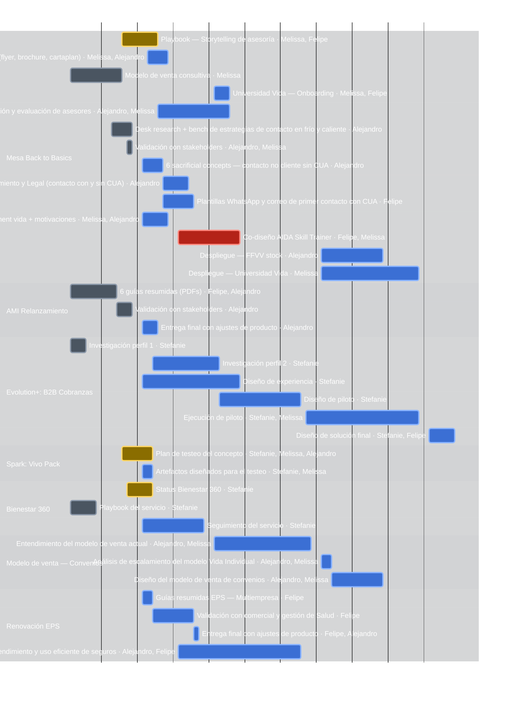

# 🐉 Tablero Beholder — Behavioral Design (RIMAC)

**Estado del proyecto:** WIP  ·  **Ciclo/Sprint:** Roadmap Q3-2026 (Chapter SD1, 22/06–13/09)  ·  **Fecha:** 2026-07-04

> **v2 — Reestructura del 2026-07-03:** tablero reconstruido desde la tabla final
> `Proyectos_BD_iniciativas.md`. Las épicas son los **proyectos BD** y los quests son las
> **iniciativas** (con fechas y monedas por persona). Claves renumeradas.
> **Economía:** las 🪙 monedas miden el **esfuerzo del trimestre**. Reglas: (1) **no usar más
> de 8 monedas al mismo tiempo** (concurrencia por fechas); (2) las monedas de una iniciativa
> se reparten **siempre en partes iguales** entre los involucrados; (3) **solo monedas
> enteras** — nadie puede tener media moneda asignada (si el total no divide, se redondea al
> múltiplo válido más cercano; en empate, hacia abajo).
> **Monedas:** una cifra por persona, en el mismo orden que la columna *Behavioral designers*.
> Las columnas **Fecha de inicio / Fecha de cierre** son campos controlados: cambiarlas
> requiere aprobación del owner. Roster, expertise y vacaciones: `reportes/beholder.config.md`.
> **Herramientas:** `python reportes/beholder_tools.py {validar|digest|gantt|retro}` ·
> el Excel se regenera desde este tablero con `python reportes/generar_matriz_status.py`.

## 📊 Resumen
| Métrica | Valor |
|---|---|
| Épicas | 9 |
| Quests (iniciativas) | 45 |
| Colaboradores (con monedas) | 4 |
| Monedas Q3 comprometidas | 81 🪙 |
| Regla de capacidad | ≤ 8 🪙 simultáneas por persona |
| Quests con riesgo alto 🚩 | 1 (Q-13 AIDA) |
| Códigos de alerta | 0 🚨 rojos · 5 ⚠️ amarillos |

## 🚨 Alertas activas
- ⚠️ **Código amarillo — Q-9 estrategia CUA en definición:** la mesa con Legal/Cumplimiento/CUA/FFVV debe cerrar antes del 10/07 (inicio del informe).
- ⚠️ **Código amarillo — Q-35 servicios valorados:** Producto pide no comunicarlos y la guía Multiempresa arranca el 06/07.
- ⚠️ **Código amarillo — Q-4/Q-5 Universidad Vida:** capacidad limitada del equipo Learning sin mitigación confirmada.
- ⚠️ **Código amarillo — Q-13 AIDA (mitigado desde rojo):** comité de priorización con 3 herramientas en paralelo; mitigación activa: consolidación + evidencia de usabilidad.
- ⚠️ **Código amarillo — Q-28 sin programar:** 2 🪙 asignadas (Stefanie 1, Melissa 1) sin fechas; al agendarse debe evitar la ventana al límite de Stefanie (08–17/07).

> ✅ **Resueltos:** 🚨 código rojo de Stefanie (pico 11) y ⚠️ amarillos de capacidad de Felipe (9)
> y Alejandro (8.5) — redistribución 50/50 en monedas enteras + cambios de fecha aprobados por
> el owner (Q-23 → 21/07, Q-5 → 09/07). Ahora todos los picos son ≤ 8.
> ✅ **Resueltos (04/07):** los 3 🚨 códigos rojos por vencimiento — Q-6, Q-7 y Q-17 se
> entregaron y pasan a Done.

## 🎯 Prioridades del comité (CoE X — Milagros)
> Cruce contra `Priorización_CoE_X_Q3_2026` (backlog que Milagros lleva a comité). Detalle
> completo, fichas de 7 campos y hallazgos en `reportes/cruce_priorizacion_coex_q3.md`.
> Última sincronización: 2026-07-05.

| Épica / Quest (Beholder) | Iniciativa en el Excel de Milagros | Prioridad de negocio | Estado en comité |
|---|---|---|---|
| EPIC-2 AMI Relanzamiento (Q-16–18) | Rimac Salud — Nuevo portafolio de productos AMI | 🔴 **Alta** | En progreso |
| EPIC-1 Mesa Back to Basics (Q-1–15) | Back to Basics — FFVV Vida Individual | Sin marcar | En progreso |
| Sub-hilo de EPIC-1 (Q-6, Q-8, Q-9) | Back to Basics — CUA | Sin marcar | Sin estado en comité |
| EPIC-6 Modelo de venta Convenios (Q-32–34) | Back to Basics — Convenios | Sin marcar | **Backlog en comité** ⚠️ (tu tablero ya la programó desde 20/07) |
| EPIC-7 Renovación EPS (Q-35–38) | Ecosistema de entendimiento y uso eficiente de seguros EPS | Sin marcar | **Backlog en comité** |
| EPIC-1 (Q-4, Q-5, Q-15) | Universidad de Vida (modelo de competencias) | Sin marcar | **Backlog en comité** |
| EPIC-4 Spark: Vivo Pack (Q-26–28) | Piloto MBI Crónicos/Pre-crónicos | Sin marcar | Sin estado en comité |
| EPIC-5 Bienestar 360 (Q-29–31) | Bienestar 360 — Piloto | Sin marcar | Sin estado en comité |
| ❌ Sin quest en el tablero | Rediseño de la Home (+Agente) | Sin marcar | En progreso |
| ❌ Sin quest en el tablero | Nuevo OMT Kit | Sin marcar | Sin estado en comité |
| ❌ Sin quest en el tablero | Evolution+ \| AMI Venta Hub Multigestión | Sin marcar | En progreso |
| ❌ Sin quest en el tablero | Guías resumidas en todos los Journeys de Onboarding activos | Sin marcar | En progreso |

**Lecturas rápidas:**
- 🔴 **Solo 1 de las 12 iniciativas de BD tiene prioridad "Alta" explícita del comité**: AMI Relanzamiento — y es, además, la más cerca de cerrarse (2 de 3 quests Done).
- ⚠️ **Cobranzas B2B (EPIC-3, S/600k, íntegramente de Stefanie) no aparece en el Excel de Milagros con capacidad Behavioral** — el comité no ve ese trabajo como tuyo.
- ⚠️ **Convenios (EPIC-6) y Ecosistema EPS (EPIC-7) siguen en Backlog para el comité**, aunque tu tablero ya les dio fecha de inicio — confirmar luz verde antes de comprometer más capacidad.
- 🚫 **"Programa de lealtad" (Alta prioridad para Milagros) se eliminó de este tablero** en la reestructura v2 y sigue sin resolver si tu equipo debe retomarlo.
- 📎 4 iniciativas donde participa BD **no tienen quest propio** en este tablero (Home+Agente, OMT Kit, Venta Hub Multigestión, Guías en Onboarding) — candidatas a incorporar si son trabajo real y activo.

## 🗂️ Tablero por estado
| Backlog | To Do | In Progress | In Review | Done |
|---|---|---|---|---|
| Q-28, Q-43, Q-44, Q-45, Q-46, Q-47 | Q-2, Q-4, Q-5, Q-8, Q-9, Q-10, Q-12, Q-13, Q-14, Q-15, Q-18, Q-21, Q-22, Q-23, Q-24, Q-25, Q-27, Q-31, Q-32, Q-33, Q-34, Q-35, Q-36, Q-37, Q-38 | Q-1, Q-26, Q-29, Q-39 | — | Q-3, Q-6, Q-7, Q-16, Q-17, Q-20, Q-30, Q-40, Q-41, Q-42 |

> Estados asignados por fechas: inicio ≤ hoy ≤ entrega → In Progress; entrega pasada → Done;
> inicio futuro → To Do; sin fechas → Backlog.

## 📅 Gantt del trimestre
> Generado desde las fechas del tablero con `python reportes/beholder_tools.py gantt`.

<!-- GANTT:START -->

<!-- GANTT:END -->

## 🎽 Tallas de los proyectos
> Tallaje t-shirt por épica: combina **esfuerzo total (🪙)**, **duración**, **personas** e
> **incertidumbre**. Rúbrica: **XS** validaciones puntuales (≤2 🪙) · **S** 3–7 🪙 y ≤3 semanas ·
> **M** 8–16 🪙, 3–6 semanas, alcance conocido · **L** esfuerzo alto con ventana larga o
> incertidumbre alta (pilotos en campo) · **XL** >20 🪙, todo el trimestre, 3+ personas o frente crítico.

| Épica | 🪙 | Duración | Personas | Talla | Driver de la talla |
|---|---|---|---|---|---|
| EPIC-1 Mesa Back to Basics | 25 | 22/06 → 28/08 (10 sem.) | 3 | **XL** | Mayor esfuerzo del Q, 15 iniciativas, frente crítico (AIDA 🚩) |
| EPIC-3 Evolution+ Cobranzas | 16 | 22/06 → 04/09 (11 sem.) | 1–2 | **L** | Piloto en campo = incertidumbre alta; casi todo sobre Stefanie |
| EPIC-7 Renovación EPS | 16 | 06/07 → 05/08 (4.5 sem.) | 2 + PD | **M** | Esfuerzo alto pero alcance definido; denso para Felipe |
| EPIC-6 Modelo venta Convenios | 10 | 20/07 → 21/08 (5 sem.) | 2 | **M** | Diseño de modelo nuevo, incertidumbre media |
| EPIC-4 Spark: Vivo Pack | 7 | 02/07 → 07/07 + análisis | 3 | **S** | Ventana corta; ojo: el go/no-go (Q-28) sigue sin fecha |
| EPIC-5 Bienestar 360 | 4 | 22/06 → 17/07 | 1 | **S** | Mantenimiento y seguimiento |
| EPIC-2 AMI Relanzamiento | 3 | 22/06 → 08/07 | 2 | **S** | Cierre cercano, solo queda la entrega final |
| EPIC-8 Arquitectura BD | — | — | Todos | **XS** | Solo validaciones pendientes de frameworks ya terminados |
| EPIC-9 Repositorio Backlog | — | — | — | — | Se dimensiona al priorizarse |

## 📋 Épicas y quests (detalle)

### EPIC-1 · Mesa Back to Basics · **Talla XL**
FFVV Vida Individual: playbook de ventas, Universidad Vida, estrategia de contacto y AIDA.

| Clave | Quest | Estado | Status del proyecto | Intervención conductual | Fecha de inicio | Fecha de cierre | Monedas | Behavioral designers | Otros perfiles | Riesgos | Impacto |
|---|---|---|---|---|---|---|---|---|---|---|---|
| Q-1 | Playbook: Storytelling de asesoría | In Progress | En curso (5 días) | Encuadre narrativo: historias que activan identificación y emoción para explicar el valor del seguro (la narrativa persuade donde la cifra no llega) | 02/07/2026 | 08/07/2026 | 1 🪙 1 🪙 | Melissa, Felipe | Service Design | — | ↓ curva de aprendizaje; +conversión |
| Q-2 | Playbook: Materiales de venta a compartir con clientes (flyer, brochure, cartaplan) | To Do | Programada (4 días); total ajustado 3 → 2 🪙 por regla de enteros | Simplificación y saliencia: reducir la carga cognitiva del mensaje y jerarquizar visualmente los beneficios clave | 07/07/2026 | 10/07/2026 | 1 🪙 1 🪙 | Melissa, Alejandro | Service Design | — | ↓ curva de aprendizaje; +conversión |
| Q-3 | Modelo de venta consultiva | Done | Entregado (7 días) | Arquitectura de la conversación: preguntas de descubrimiento que anclan la oferta en las motivaciones del cliente, no en el producto | 22/06/2026 | 01/07/2026 | 1 🪙 | Melissa | Service Design | — | ↓ curva de aprendizaje; +conversión |
| Q-4 | Universidad Vida — Onboarding | To Do | Programada (3 días) | Formación de hábitos tempranos del asesor: práctica espaciada y feedback inmediato desde el día 1 | 20/07/2026 | 22/07/2026 | 2 🪙 2 🪙 | Melissa, Felipe | Service Design | Capacidad limitada equipo Learning | −25–40% ramp-up asesores jr (est.) |
| Q-5 | Universidad Vida — Modelo de competencias, calendarización y evaluación de asesores | To Do | Programada; inicio movido al 09/07 (aprobado por owner, 03/07) | Progresión por niveles con evaluación y reconocimiento: metas visibles + refuerzo de estatus para sostener la motivación del asesor | 09/07/2026 | 22/07/2026 | 2 🪙 2 🪙 | Alejandro, Melissa | Service Design | Capacidad limitada equipo Learning | −25–40% ramp-up asesores jr (est.) |
| Q-6 | Desk research + bench de estrategias de contacto en frío y caliente | Done | Entregado (4 días) | Evidencia de qué gatillos abren conversación en frío vs. caliente (reciprocidad, curiosidad, personalización) | 30/06/2026 | 03/07/2026 | 0 🪙 | Alejandro | Service Design | — | Insumo para estrategia de contacto |
| Q-7 | Validación con stakeholders | Done | Entregado (1 día) | Co-creación con stakeholders: la participación temprana genera ownership y facilita la adopción posterior | 03/07/2026 | 03/07/2026 | 0 🪙 0 🪙 | Alejandro, Melissa | Service Design | — | Alineamiento de la mesa |
| Q-8 | 6 sacrificial concepts: contacto no cliente sin CUA | To Do | Programada (4 días) | Conceptos provocadores para elicitar reacciones y objeciones reales de no clientes (preferencias reveladas, no declaradas) | 06/07/2026 | 09/07/2026 | 0 🪙 | Alejandro | Service Design | — | Insumo para estrategia sin CUA |
| Q-9 | Informe con estrategias validadas por CUA, Cumplimiento y Legal (contacto con y sin CUA) | To Do | Programada (3 días); mesa con Legal, Cumplimiento, CUA y FFVV | Arquitectura de decisión del primer contacto dentro del marco legal: canal, momento y mensaje que maximizan respuesta sin fricción normativa | 10/07/2026 | 14/07/2026 | 2 🪙 | Alejandro | Service Design | Estrategia CUA en definición | +20–30% agendamiento de citas (est.) |
| Q-10 | Plantillas WhatsApp y correo de primer contacto **con** CUA | To Do | Programada (4 días) | Mensajes con personalización, prueba social y mínima fricción de respuesta (contestar debe costar un toque) | 10/07/2026 | 15/07/2026 | 2 🪙 | Felipe | Service Design | — | +20–30% agendamiento de citas (est.) |
| Q-12 | Actualizar materiales de venta del asesor con statement vida + motivaciones | To Do | Programada (5 días) | Alineación mensaje-motivación: pitch segmentado por perfil motivacional + statement de vida como compromiso público del asesor | 06/07/2026 | 10/07/2026 | 2 🪙 2 🪙 | Melissa, Alejandro | Service Design | — | ↓ curva de aprendizaje; +conversión |
| Q-13 | Co-diseño AIDA Skill Trainer | To Do | Programada (9 días); pairing junior + semi senior para el comité; total ajustado 3 → 2 🪙 por regla de enteros | Práctica deliberada simulada: role-play con IA, feedback inmediato y puntaje → acelera la curva de aprendizaje sin costo de clientes reales | 13/07/2026 | 24/07/2026 | 1 🪙 1 🪙 | Felipe, Melissa | Service Design | Comité de priorización; 3 herramientas en paralelo 🚩 | +efectividad asesor y CX; ahorro proyectado S/1.8M |
| Q-14 | Despliegue: FFVV stock | To Do | Programada (10 días) | Estrategia de adopción: defaults, recordatorios y campeones internos para instalar las nuevas prácticas en la fuerza de venta actual | 10/08/2026 | 21/08/2026 | 1 🪙 | Alejandro | Service Design | — | Adopción de la estrategia en FFVV actual |
| Q-15 | Despliegue: Universidad Vida | To Do | Programada (15 días) | Adopción por cohortes con hitos visibles y reconocimiento: sostener el hábito formativo más allá del lanzamiento | 10/08/2026 | 28/08/2026 | 1 🪙 | Melissa | Service Design | — | Adopción del modelo por competencias |

### EPIC-2 · AMI Relanzamiento · **Talla S**
Relanzamiento AMI: guías resumidas para el entendimiento y uso eficiente de los nuevos productos.

| Clave | Quest | Estado | Status del proyecto | Intervención conductual | Fecha de inicio | Fecha de cierre | Monedas | Behavioral designers | Otros perfiles | Riesgos | Impacto |
|---|---|---|---|---|---|---|---|---|---|---|---|
| Q-16 | 6 guías resumidas (PDFs) | Done | Entregadas (6 días) | Simplificación radical de la póliza: lenguaje claro, ejemplos concretos y jerarquía de coberturas — ataca la sobrecarga informativa, causa #1 de desconfianza en seguros | 22/06/2026 | 30/06/2026 | 0 🪙 0 🪙 | Felipe, Alejandro | Service Design | — | ↓ ~25–30% casos NPS «no recibí información» (est.) |
| Q-17 | Validación con stakeholders | Done | Entregada (3 días); check de Producto y equipo médico completado (nombre, coberturas, red, servicios) | Chequeo de comprensión real: testear que el usuario entiende, no solo que el stakeholder aprueba | 01/07/2026 | 03/07/2026 | 0 🪙 | Alejandro | Service Design | — | ↓ «no recibí información» |
| Q-18 | Entrega final con ajustes de producto | To Do | Programada (3 días) | Iteración final: cerrar las brechas de comprensión detectadas en la validación | 06/07/2026 | 08/07/2026 | 3 🪙 | Alejandro | Service Design | — | ↓ «no recibí información» |

### EPIC-3 · Evolution+: B2B Cobranzas · **Talla L**
Optimizar la conciliación de pagos B2B; prioridad: facturas de corporativas y gran empresa (mayor volumen).

| Clave | Quest | Estado | Status del proyecto | Intervención conductual | Fecha de inicio | Fecha de cierre | Monedas | Behavioral designers | Otros perfiles | Riesgos | Impacto |
|---|---|---|---|---|---|---|---|---|---|---|---|
| Q-20 | Investigación perfil 1 | Done | Entregada (3 días) — incluye quick fix del correo de conciliación | Diagnóstico conductual del proceso: dónde se rompe el flujo de datos (fricciones y hassle factors del pagador B2B) | 22/06/2026 | 24/06/2026 | 0 🪙 | Stefanie | Service Design | — | Quick fix evita congelar dinero |
| Q-21 | Investigación perfil 2 | To Do | Programada (9 días) | Mapeo de barreras y motivaciones del segundo perfil de pagador B2B | 08/07/2026 | 20/07/2026 | 4 🪙 | Stefanie | Service Design | — | Liberación de S/600k provisionados (proyecto) |
| Q-22 | Diseño de experiencia | To Do | Programada (6 días) | Rediseño del journey de conciliación: menos fricción, próximos pasos claros y recordatorios en el momento oportuno | 06/07/2026 | 24/07/2026 | 3 🪙 | Stefanie | Service Design | — | Liberación de S/600k provisionados (proyecto) |
| Q-23 | Diseño de piloto | To Do | Programada; inicio movido al 21/07 (aprobado por owner, 03/07) para respetar la regla de ≤ 8 | Experimento controlado: hipótesis conductuales, métricas de respuesta y grupos de comparación | 21/07/2026 | 05/08/2026 | 3 🪙 | Stefanie | Service Design | — | — |
| Q-24 | Ejecución de piloto | To Do | Programada (16 días); entra Melissa (bus factor); total ajustado 5 → 4 🪙 por regla de enteros | Prueba en campo midiendo conducta real (conciliación a tiempo), no intención declarada | 07/08/2026 | 28/08/2026 | 2 🪙 2 🪙 | Stefanie, Melissa | Service Design | — | — |
| Q-25 | Diseño de solución final | To Do | Programada (5 días); entra Felipe (aprendizaje de cierre E2E); total ajustado 3 → 2 🪙 por regla de enteros | Escalar solo los nudges con evidencia del piloto; descartar lo que no movió conducta | 31/08/2026 | 04/09/2026 | 1 🪙 1 🪙 | Stefanie, Felipe | Service Design | — | Liberación de S/600k provisionados (proyecto) |

### EPIC-4 · Spark: Vivo Pack · **Talla S**
Testeo de concepto Vivo Pack.

| Clave | Quest | Estado | Status del proyecto | Intervención conductual | Fecha de inicio | Fecha de cierre | Monedas | Behavioral designers | Otros perfiles | Riesgos | Impacto |
|---|---|---|---|---|---|---|---|---|---|---|---|
| Q-26 | Plan de testeo del concepto | In Progress | En curso (4 días); total ajustado 4 → 3 🪙 por regla de enteros | Diseño del test: hipótesis conductuales de comprensión, intención y disposición a pagar | 02/07/2026 | 07/07/2026 | 1 🪙 1 🪙 1 🪙 | Stefanie, Melissa, Alejandro | Service Design | — | Validación del concepto (por medir) |
| Q-27 | Artefactos diseñados para el testeo | To Do | Programada (2 días) | Estímulos que hacen tangible el producto: la concreción visual reduce la abstracción del seguro | 06/07/2026 | 07/07/2026 | 1 🪙 1 🪙 | Stefanie, Melissa | Service Design | — | — |
| Q-28 | Análisis y síntesis del test | Backlog | Sin programar en el gantt (0 días pintados) | Síntesis separando lo que la gente dice de lo que hace (brecha dicho-hecho) para el go/no-go | — | — | 1 🪙 1 🪙 | Stefanie, Melissa | Service Design | Suma al pico cuando se agende | Decisión go/no-go del concepto |

### EPIC-5 · Bienestar 360 · **Talla S**
Programa implementado; fase de mantenimiento y seguimiento.

| Clave | Quest | Estado | Status del proyecto | Intervención conductual | Fecha de inicio | Fecha de cierre | Monedas | Behavioral designers | Otros perfiles | Riesgos | Impacto |
|---|---|---|---|---|---|---|---|---|---|---|---|
| Q-29 | Status Bienestar 360 | In Progress | En curso (3 días) | Monitoreo de métricas conductuales del programa (adherencia y engagement, no solo satisfacción) | 03/07/2026 | 07/07/2026 | 1 🪙 | Stefanie | Service Design | — | +3 ptos Wellby · CSAT 4.6/5 · NPS 78 |
| Q-30 | Playbook del servicio | Done | Entregado (5 días) | Codificación del modelo de cambio de hábitos del programa para hacerlo replicable | 22/06/2026 | 26/06/2026 | 2 🪙 | Stefanie | Service Design | — | Continuidad del programa |
| Q-31 | Seguimiento del servicio | To Do | Programada (10 días) | Prevención del decaimiento del hábito: refuerzos post-implementación para sostener la conducta | 06/07/2026 | 17/07/2026 | 1 🪙 | Stefanie | Service Design | Presupuesto limitado para v2 | Mantenimiento de métricas |

### EPIC-6 · Modelo de venta — Convenios · **Talla M**
Nuevo modelo de venta para convenios (antes en Backlog; ahora con iniciativas y fechas).

| Clave | Quest | Estado | Status del proyecto | Intervención conductual | Fecha de inicio | Fecha de cierre | Monedas | Behavioral designers | Otros perfiles | Riesgos | Impacto |
|---|---|---|---|---|---|---|---|---|---|---|---|
| Q-32 | Entendimiento del modelo de venta actual | To Do | Programada (11 días) | Mapeo conductual del canal: actores, incentivos y fricciones en la decisión del empleado en convenio | 20/07/2026 | 07/08/2026 | 2 🪙 2 🪙 | Alejandro, Melissa | Service Design | Sponsors: Diana Riofrío, Patricia Romero, Claro Gomez | Escalamiento del modelo de venta VI |
| Q-33 | Análisis de escalamiento del modelo Vida Individual | To Do | Programada (2 días) | Evaluar qué palancas conductuales del modelo VI son transferibles al canal convenios y cuáles no | 10/08/2026 | 11/08/2026 | 1 🪙 1 🪙 | Alejandro, Melissa | Service Design | — | Escalamiento del modelo de venta VI |
| Q-34 | Diseño del modelo de venta de convenios | To Do | Programada (8 días) | Arquitectura de decisión del nuevo canal: incentivos, defaults y flujo de decisión del empleado | 12/08/2026 | 21/08/2026 | 2 🪙 2 🪙 | Alejandro, Melissa | Service Design | — | Escalamiento del modelo de venta VI |

### EPIC-7 · Renovación EPS · **Talla M**
Guías EPS y ecosistema de entendimiento; revisión de la Dra. Ana Gabriela Ramos (Dir. Médica Seguros Salud) en curso.

| Clave | Quest | Estado | Status del proyecto | Intervención conductual | Fecha de inicio | Fecha de cierre | Monedas | Behavioral designers | Otros perfiles | Riesgos | Impacto |
|---|---|---|---|---|---|---|---|---|---|---|---|
| Q-35 | Guías resumidas EPS: Multiempresa | To Do | Programada (2 días) | Simplificación de la póliza EPS multiempresa: lenguaje claro y saliencia de las coberturas que el afiliado más usa | 06/07/2026 | 07/07/2026 | 6 🪙 | Felipe | — | Producto pide no comunicar servicios valorados | Renovación cuentas TOP EPS |
| Q-36 | Validación con comercial y gestión de Salud | To Do | Programada (6 días) | Chequeo de comprensión y viabilidad comercial: qué comunicar sin generar expectativas que el producto no cumple | 08/07/2026 | 15/07/2026 | 2 🪙 | Felipe | — | — | Renovación cuentas TOP EPS |
| Q-37 | Entrega final con ajustes de producto | To Do | Programada (1 día); entra Alejandro (el senior co-firma la entrega) | Iteración final con ajustes de producto | 16/07/2026 | 16/07/2026 | 2 🪙 2 🪙 | Felipe, Alejandro | — | — | ↓ «no recibí información» en corporativo |
| Q-38 | Diseño To Be: Ecosistema de entendimiento y uso eficiente de seguros | To Do | Programada (15 días) | Educación justo-a-tiempo: touchpoints de entendimiento a lo largo del journey del asegurado — la información llega en el momento de uso, no en la firma | 13/07/2026 | 05/08/2026 | 2 🪙 2 🪙 | Alejandro, Felipe | Product Design | — | Palancas de entendimiento capturadas en encuesta NPS y CSAT |

### EPIC-8 · Arquitectura BD (capacidades del equipo) · **Talla XS**
Frameworks y herramientas del Chapter (se conservan sin cambios).

| Clave | Quest | Estado | Status del proyecto | Intervención conductual | Fecha de inicio | Fecha de cierre | Monedas | Behavioral designers | Otros perfiles | Riesgos | Impacto |
|---|---|---|---|---|---|---|---|---|---|---|---|
| Q-39 | Modelo de entendimiento y uso eficiente de seguros | In Progress | Framework terminado; falta alinear con los frentes involucrados | Framework interno: palancas de entendimiento y uso del seguro para diseñar intervenciones consistentes | — | — | — | Todos | — | — | Framework de entendimiento y uso eficiente |
| Q-40 | Sistema de generación de usuarios sintéticos | Done | Terminado, por validar | Capacidad interna: simular conducta de usuarios para pretestear intervenciones antes del campo | — | — | — | Todos | — | — | Agilidad en el testeo de conducta con seguros |
| Q-41 | Modelo de cambio de hábitos | Done | Terminado y validado | Framework interno: modelo de formación y sostenimiento de hábitos para iniciativas de salud/bienestar | — | — | — | Todos | — | — | Framework para iniciativas de cambio de hábitos |
| Q-42 | Skill para desk research con rigurosidad científica | Done | Terminado, por validar | Capacidad interna: investigación de escritorio con estándar de evidencia | — | — | — | Todos | — | — | Agilidad y calidad de la investigación de escritorio |

### EPIC-9 · Repositorio de iniciativas en Backlog
Repositorio de iniciativas aún no activadas. Su estado es solo **Backlog**: entran aquí sin
fechas, monedas ni perfiles, y salen hacia una épica activa cuando se priorizan.

| Clave | Quest | Estado | Status del proyecto | Intervención conductual | Fecha de inicio | Fecha de cierre | Monedas | Behavioral designers | Otros perfiles | Riesgos | Impacto |
|---|---|---|---|---|---|---|---|---|---|---|---|
| Q-43 | RIMAC Wrap (tangibilización pre-renovación) | Backlog | Backlog | Por definir (hipótesis: tangibilizar el valor usado del seguro antes de renovar — efecto dotación) | — | — | — | (por confirmar) | — | — | — |
| Q-44 | Recordatorio multicanal (SMS/WhatsApp/Push) | Backlog | Backlog | Por definir (hipótesis: prompts oportunos multicanal contra la inercia y el olvido) | — | — | — | (por confirmar) | — | — | — |
| Q-45 | Sistema de incentivos orientados a la experiencia | Backlog | Backlog | Por definir | — | — | — | (por confirmar) | — | — | — |
| Q-46 | Vida Individual — Experiencia Postventa | Backlog | Backlog | Por definir | — | — | — | (por confirmar) | — | Sponsor: Diana Riofrío | — |
| Q-47 | Ahorro Salud — Derivación eficiente MER | Backlog | Backlog | Por definir | — | — | — | (por confirmar) | — | — | — |

## 🔗 Dependencias
> Cadenas inferidas de las fases de cada proyecto (confírmalas/ajústalas). Ante un cambio de
> fecha, el Beholder evalúa el **efecto dominó** aguas abajo y alerta si la cadena se rompe.

| Quest | Depende de | Cadena |
|---|---|---|
| Q-9 | Q-6, Q-7, Q-8 | Research + validación + sacrificial concepts → informe CUA |
| Q-10 | Q-9 | Informe CUA → plantillas de contacto con CUA |
| Q-14 | Q-9, Q-10, Q-12 | Estrategia + materiales → despliegue FFVV stock |
| Q-15 | Q-4, Q-5 | Onboarding + modelo de competencias → despliegue UV |
| Q-18 | Q-17 | Validación → entrega final guías AMI |
| Q-23 | Q-21, Q-22 | Investigación + diseño de experiencia → piloto |
| Q-24 | Q-23 | Diseño de piloto → ejecución |
| Q-25 | Q-24 | Ejecución del piloto → solución final |
| Q-27 | Q-26 | Plan de testeo → artefactos |
| Q-28 | Q-27 | Test ejecutado → análisis y síntesis |
| Q-33 | Q-32 | Entendimiento del modelo → análisis de escalamiento |
| Q-34 | Q-33 | Análisis → diseño del modelo de venta |
| Q-36 | Q-35 | Guía Multiempresa → validación |
| Q-37 | Q-36 | Validación → entrega final EPS |

## 🪙 Libro mayor de monedas (capacidad del equipo)
> **Economía Q3:** las monedas miden el esfuerzo total del trimestre por persona.
> **Regla 1:** nadie usa **más de 8 monedas al mismo tiempo**. **Regla 2:** reparto en
> **partes iguales** por iniciativa. **Regla 3:** **solo monedas enteras**.
> Nivel de expertise del roster: `reportes/beholder.config.md`.

| Colaborador | Expertise | Monedas Q3 (total) | Pico simultáneo | Ventana del pico | Estado |
|---|---|---|---|---|---|
| Alejandro | Senior | 21 | 7 | 07/07 y 10/07 | 🟢 Dentro de la regla |
| Melissa | Semi senior | 21 | 7 | 20/07 → 22/07 | 🟢 Dentro de la regla |
| Stefanie | Semi senior | 20 | 8 | 08/07 → 17/07 | 🟢 Al límite (8) |
| Felipe | Junior (6 meses) | 19 | 7 | 06/07 → 07/07 y 13/07 → 15/07 | 🟢 Dentro de la regla |

**Alertas de capacidad:** sin alertas — todos los picos respetan la regla de ≤ 8 simultáneas.
- ⚠️ **Monedas sin programar:** Q-28 (Stefanie: 1, Melissa: 1). Sumarán al pico cuando se agende.
- Nota: Stefanie queda **al límite (8)** entre el 08/07 y el 17/07 — no agendar nada nuevo en esa ventana.
- 🏖️ **Vacaciones:** ninguna registrada. Se registran en el roster de la config; durante
  vacaciones la capacidad es **0** y el trabajo agendado en ese periodo dispara 🚨 código rojo.

## 🚩 Registro de riesgos
| Clave | Quest | Riesgo | Probabilidad | Impacto | Código | Mitigación sugerida |
|---|---|---|---|---|---|---|
| Q-13 | AIDA Skill Trainer | Comité de priorización; 3 herramientas en paralelo | Media | Alto | ⚠️ Amarillo (rojo con mitigación activa) | Consolidar a 1 herramienta antes del comité; llevar evidencia de usabilidad |
| Q-9 | Informe estrategias CUA | Estrategia CUA aún en definición (mesa Legal/Cumplimiento/CUA/FFVV) | Media | Medio | ⚠️ Amarillo | Cerrar definición en la mesa antes del 10/07 |
| Q-35 | Guías EPS Multiempresa | Producto pide no comunicar servicios valorados | Media | Medio | ⚠️ Amarillo | Alinear con Producto en la validación (Q-36) |
| Q-4/Q-5 | Universidad Vida | Capacidad limitada del equipo Learning | Media | Medio | ⚠️ Amarillo | Priorizar diseño instruccional con Learning |
| — | Capacidad Stefanie | Al límite (8) entre 08–17/07; cualquier agregado la pasa de la regla | Baja | Medio | 🟢 Verde | No agendar trabajo nuevo en esa ventana (Q-28 incluido) |
| Q-28 | Sin programar | Monedas asignadas sin fechas → riesgo de pico al agendar | Baja | Medio | 🟢 Verde | Agendar fuera de la ventana 08–17/07 de Stefanie |

## 📈 Impacto
| Clave | Quest | Impacto esperado |
|---|---|---|
| Q-13 | AIDA Skill Trainer | +efectividad del asesor (puntaje del bot) y consistencia CX; ahorro proyectado S/1.8M |
| Q-20–Q-25 | Evolution+ B2B Cobranzas | Liberación de S/600k provisionados; quick fix del correo de conciliación ya evita congelar dinero |
| Q-16–Q-18 | AMI Relanzamiento (guías resumidas) | ↓ ~25–30% casos NPS «no recibí información» (est.) |
| Q-35–Q-37 | Guías EPS | Renovación de cuentas TOP EPS; ↓ «no recibí información» en corporativo |
| Q-38 | Ecosistema de entendimiento | Palancas de entendimiento capturadas en encuesta NPS y CSAT |
| Q-1–Q-3, Q-12 | Playbook de Ventas | ↓ curva de aprendizaje del asesor; +conversión de venta (físico, virtual y copilotos) |
| Q-4, Q-5, Q-15 | Universidad Vida | −25–40% tiempo de ramp-up de asesores jr (est.) |
| Q-9, Q-10 | Estrategia de primer contacto | +20–30% agendamiento de citas (est.) |
| Q-29–Q-31 | Bienestar 360 | +3 ptos Wellby · CSAT 4.6/5 · NPS 78 |
| Q-26–Q-28 | Spark: Vivo Pack | Validación del concepto (por medir en el test) |
| Q-32–Q-34 | Modelo de venta Convenios | Escalamiento del modelo de venta de Vida Individual |
