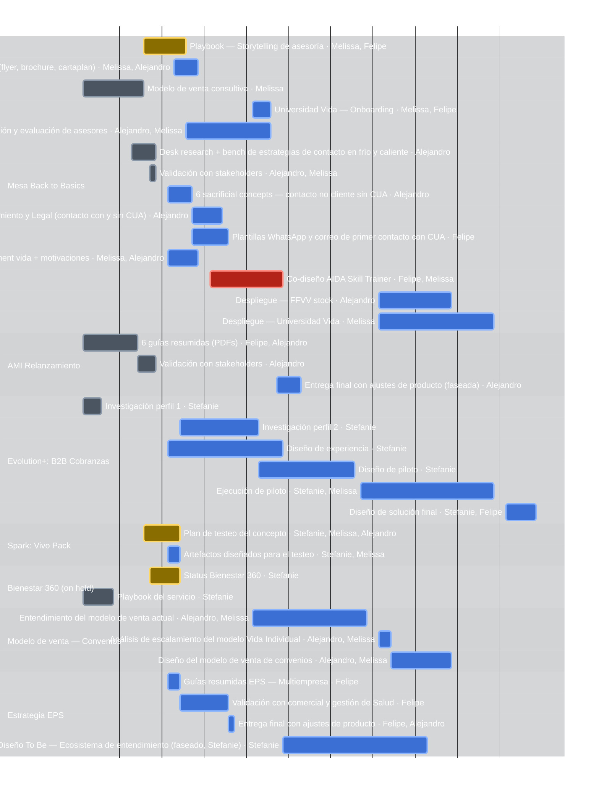

# 🐉 Tablero Beholder — Behavioral Design (RIMAC)

**Estado del proyecto:** WIP  ·  **Ciclo/Sprint:** Roadmap Q3-2026 (Chapter SD1, 22/06–13/09)  ·  **Fecha:** 2026-07-04

> **v2 — Reestructura del 2026-07-03:** tablero reconstruido desde la tabla final
> `Proyectos_BD_iniciativas.md`. Las épicas son los **proyectos BD** y los quests son las
> **iniciativas** (con fechas y monedas por persona). Claves renumeradas.
> **Economía:** las 🪙 monedas miden el **esfuerzo del trimestre**. Reglas: (1) **no usar más
> de 8 monedas al mismo tiempo** (concurrencia por fechas); (2) las monedas de una iniciativa
> se reparten **siempre en partes iguales** entre los involucrados; (3) **solo monedas
> enteras** — nadie puede tener media moneda asignada (si el total no divide, se redondea al
> múltiplo válido más cercano; en empate, hacia abajo).
> **Monedas:** una cifra por persona, en el mismo orden que la columna *Behavioral designers*.
> Las columnas **Fecha de inicio / Fecha de cierre** son campos controlados: cambiarlas
> requiere aprobación del owner. Roster, expertise y vacaciones: `reportes/beholder.config.md`.
> **Herramientas:** `python reportes/beholder_tools.py {validar|digest|gantt|retro}` ·
> el Excel se regenera desde este tablero con `python reportes/generar_matriz_status.py`.

## 🎯 Perform vs. Transform (marco del trimestre)
> Lógica **80% Perform / 20% Transform**. Todo lo priorizado en comité hasta ahora es de
> naturaleza **Perform** — no hay todavía un frente Transform de equipo con luz verde. Excepción:
> **Alejandro y Jonathan (Lead Service Design)** van a trabajar, a nivel individual (no de
> equipo), algunas iniciativas **Transform de Salud** — es cómo Alejandro cubre más frentes.
> EPIC-10 Exploración Salud queda etiquetada Transform por esto.

**Las 2 prioridades del comité, en orden:**
1. **Back to Basics — Fuerza de Venta Vida** (EPIC-1). Equipo: Melissa y Alejandro, junto con
   **César** (Lead de Service Design, otro equipo).
2. **Estrategia EPS** (EPIC-7, antes "Renovación EPS" — nueva propuesta de valor). Equipo:
   **Stefanie y Jonathan** (Lead Service Design).

## 📊 Resumen
| Métrica | Valor |
|---|---|
| Épicas | 10 |
| Quests (iniciativas) | 67 |
| Colaboradores (con monedas) | 4 |
| Monedas Q3 comprometidas | 93 🪙 |
| Regla de capacidad | ≤ 8 🪙 simultáneas por persona |
| Quests con riesgo alto 🚩 | 1 (Q-13 AIDA) |
| Códigos de alerta | 0 🚨 rojos (los 2 de capacidad se resolvieron faseando) · 11 ⚠️ amarillos — aparte, 15 quests vencidos sin resolver (crónico, ver nota) |

## 🚨 Alertas activas
- ⚠️ **Código amarillo — Q-9 estrategia CUA en definición:** la mesa con Legal/Cumplimiento/CUA/FFVV debe cerrar antes del 10/07 (inicio del informe).
- ⚠️ **Código amarillo — Q-35 servicios valorados:** Producto pide no comunicarlos y la guía Multiempresa arranca el 06/07.
- ⚠️ **Código amarillo — Q-4/Q-5 Universidad Vida:** capacidad limitada del equipo Learning sin mitigación confirmada.
- ⚠️ **Código amarillo — Q-13 AIDA (mitigado desde rojo):** comité de priorización con 3 herramientas en paralelo; mitigación activa: consolidación + evidencia de usabilidad.
- ⚠️ **Código amarillo — Q-28 sin programar:** 2 🪙 asignadas (Stefanie 1, Melissa 1) sin fechas; al agendarse debe evitar la ventana al límite de Stefanie (08–17/07).
- ⚠️ **Código amarillo — Q-48 sin programar:** 6 🪙 asignadas a Alejandro (modelo de retención con Edu Rebata); sin fechas porque el acceso a data de renovación/siniestros aún depende de otras áreas. Al agendarse, revisar que no empuje el pico de Alejandro (hoy 7, margen de solo 1 antes del límite de 8).
- ⚠️ **Código amarillo — Q-53 sin programar:** 3 🪙 asignadas a Felipe (plantillas de contacto sin CUA) sin fechas.
- ⚠️ **Código amarillo — Q-58 sin programar:** 1 🪙 asignada a Felipe (guías EPS Banbif: validación) sin fechas.
- ⚠️ **Código amarillo — Q-59 sin programar:** 2 🪙 (Alejandro 1, Felipe 1) — guías EPS Banbif: entrega final — sin fechas.
- ⚠️ **Código amarillo — Q-31 sin programar:** 1 🪙 (Stefanie) — quedó sin fechas al pausar el quest (on hold); no cuenta para capacidad mientras siga en pausa.
- ⚠️ **Código amarillo — Q-32 (Convenios) ya inició pese a la secuencia pedida:** el owner pidió esperar al cierre de Back to Basics (EPIC-1, sigue abierto) antes de avanzar Convenios, pero Q-32 ya tiene inicio el 20/07. Confirmar si se pausa o se acepta el solape.

> ✅ **Resueltos:** 🚨 código rojo de Stefanie (pico 11) y ⚠️ amarillos de capacidad de Felipe (9)
> y Alejandro (8.5) — redistribución 50/50 en monedas enteras + cambios de fecha aprobados por
> el owner (Q-23 → 21/07, Q-5 → 09/07). Ahora todos los picos son ≤ 8.
> ✅ **Resueltos (04/07):** los 3 🚨 códigos rojos por vencimiento — Q-6, Q-7 y Q-17 se
> entregaron y pasan a Done.
> ✅ **Resueltos (fasear, no redistribuir):** los 2 🚨 rojos de capacidad de este batch —
> Stefanie (pico 12 → 7) y Alejandro (pico 10 → 7) — se resolvieron **sin mover a nadie de las
> historias**: Q-18 se concentró en una ventana corta justo antes de su deadline (24–28/07 en
> vez de 06–28/07) y Q-38 se corrió para arrancar cuando Stefanie libera capacidad de Cobranzas
> (25/07 en vez de 13/07). Ver § Análisis de capacidad (experto en gestión) más abajo.

## 🔍 Pendientes de confirmar (cruce con el sheet de compromisos a Milagros)
> Del cruce entre este tablero y las tareas comprometidas que compartiste — no son riesgos de
> capacidad ni fechas, son preguntas de datos abiertas antes de tratarlas como definitivas.

- **Q-21 (Investigación perfil 2, B2B Cobranzas):** el sheet comprometido a Milagros dice **6 días**; el tablero tiene programados **9 días** (08/07→20/07). Confirmar con Stefanie cuál es el real antes de cerrar — Q-21 además está vencido (ver códigos rojos abajo).
- **Q-1 (Playbook Storytelling):** el sheet comprometido lista a **Alejandro**; el tablero tiene a **Felipe** junto con Melissa. Confirmar si hubo reasignación.
- **Q-38 (Diseño To Be Ecosistema EPS):** el sheet comprometido lista a **Stefanie**; el tablero tiene a **Felipe** junto con Alejandro. Confirmar si hubo reasignación.

## 🎯 Prioridades del comité (CoE X — Milagros)
> Cruce contra `Priorización_CoE_X_Q3_2026` (backlog que Milagros lleva a comité). Detalle
> completo, fichas de 7 campos y hallazgos en `reportes/cruce_priorizacion_coex_q3.md`.
> Última sincronización de la tabla: 2026-07-05. **Actualización verbal del owner (posterior):**
> el comité ya definió Back to Basics y Estrategia EPS como las 2 prioridades — ver
> § Perform vs. Transform arriba; esa es la fuente más reciente donde entren en conflicto.

| Épica / Quest (Beholder) | Iniciativa en el Excel de Milagros | Prioridad de negocio | Estado en comité |
|---|---|---|---|
| EPIC-1 Mesa Back to Basics (Q-1–15, Q-53–65, incluye CUA: Q-6, Q-8, Q-9) | Back to Basics — FFVV Vida Individual (CUA fusionado como componente (a) del problema) | 🔴 **Alta — Prioridad #1** (actualizado por el owner) | En progreso |
| EPIC-7 Estrategia EPS (Q-35–38, Q-48, Q-58–59) | Ecosistema de entendimiento y uso eficiente de seguros EPS | 🔴 **Alta — Prioridad #2** (actualizado por el owner; antes "Backlog en comité") | En progreso |
| EPIC-2 AMI Relanzamiento (Q-16–18, Q-60–61) | Rimac Salud — Nuevo portafolio de productos AMI | 🔴 **Alta** | Cerrando (28/07) |
| EPIC-4 Spark: Vivo Pack (Q-26–28) | Piloto MBI Crónicos/Pre-crónicos | Sin marcar | Confirmado por el owner — continúa |
| EPIC-6 Modelo de venta Convenios (Q-32–34) | Back to Basics — Convenios | Sin marcar | **Backlog en comité** ⚠️ — además, el owner pidió secuenciarlo después del cierre de EPIC-1 (ver conflicto de fechas en la épica) |
| EPIC-5 Bienestar 360 (Q-29–31) | Bienestar 360 — Piloto | Sin marcar | **Despriorizado por el owner** — on hold hasta definir con Estar Bien |
| EPIC-1 (Q-4, Q-5, Q-65) | Universidad de Vida (modelo de competencias) | Sin marcar | **Backlog en comité**; Q-65 la extiende a programa de crecimiento |
| ❌ Sin quest en el tablero | Rediseño de la Home (+Agente) | Sin marcar | En progreso — posible mismo frente que Q-52 (Agente Web y App, EPIC-10) |
| ❌ Sin quest en el tablero | Nuevo OMT Kit | Sin marcar | Sin estado en comité |
| ❌ Sin quest en el tablero | Evolution+ \| AMI Venta Hub Multigestión | Sin marcar | En progreso |
| ❌ Sin quest en el tablero | Guías resumidas en todos los Journeys de Onboarding activos | Sin marcar | En progreso |

**Lecturas rápidas:**
- 🔴 **El comité ya elevó a Back to Basics y Estrategia EPS a Alta prioridad** — antes solo AMI Relanzamiento tenía esa marca explícita en el Excel de Milagros; la actualización verbal del owner es más reciente que el Excel.
- 🔀 **CUA ya no es una fila propia para el comité**: Milagros la fusionó dentro de "Back to Basics — FFVV Vida Individual" como el componente (a) del problema (contacto sin CUA = riesgo legal); Q-63 (alertas CRM) es la mitigación concreta que sale de esta fusión.
- ⚠️ **Cobranzas B2B (EPIC-3, S/600k, íntegramente de Stefanie) no aparece en el Excel de Milagros con capacidad Behavioral** — el comité no ve ese trabajo como tuyo. Ahora además está cerrando, así que probablemente deje de ser relevante para este cruce.
- 🚫 **"Programa de lealtad" (Alta prioridad para Milagros) se eliminó de este tablero** en la reestructura v2 y sigue sin resolver si tu equipo debe retomarlo.
- 📎 4 iniciativas donde participa BD **no tienen quest propio** en este tablero (Home+Agente, OMT Kit, Venta Hub Multigestión, Guías en Onboarding) — candidatas a incorporar si son trabajo real y activo. "Home+Agente" probablemente ya es Q-52.

## 🗂️ Tablero por estado
| Backlog | To Do | In Progress | In Review | Done |
|---|---|---|---|---|
| Q-28, Q-43, Q-44, Q-45, Q-46, Q-47, Q-48, Q-49, Q-50, Q-51, Q-52, Q-53, Q-54, Q-55, Q-56, Q-57, Q-58, Q-59, Q-62, Q-63, Q-64, Q-65, Q-66, Q-67 | Q-2, Q-4, Q-5, Q-8, Q-9, Q-10, Q-12, Q-13, Q-14, Q-15, Q-18, Q-21, Q-22, Q-23, Q-24, Q-25, Q-27, Q-32, Q-33, Q-34, Q-35, Q-36, Q-37, Q-38 | Q-1, Q-26, Q-29, Q-39 | — | Q-3, Q-6, Q-7, Q-16, Q-17, Q-20, Q-30, Q-40, Q-41, Q-42, Q-60, Q-61 |

> Estados asignados por fechas: inicio ≤ hoy ≤ entrega → In Progress; entrega pasada → Done;
> inicio futuro → To Do; sin fechas → Backlog. **Q-31 queda fuera de estas 5 columnas**: está
> **On Hold** (despriorizado, ver EPIC-5) — no cuenta como To Do activo.

## 📅 Gantt del trimestre
> Generado desde las fechas del tablero con `python reportes/beholder_tools.py gantt`.

<!-- GANTT:START -->

<!-- GANTT:END -->

## 🎽 Tallas de los proyectos
> Tallaje t-shirt por épica: combina **esfuerzo total (🪙)**, **duración**, **personas** e
> **incertidumbre**. Rúbrica: **XS** validaciones puntuales (≤2 🪙) · **S** 3–7 🪙 y ≤3 semanas ·
> **M** 8–16 🪙, 3–6 semanas, alcance conocido · **L** esfuerzo alto con ventana larga o
> incertidumbre alta (pilotos en campo) · **XL** >20 🪙, todo el trimestre, 3+ personas o frente crítico.

| Épica | 🪙 | Duración | Personas | Talla | Driver de la talla |
|---|---|---|---|---|---|
| EPIC-1 Mesa Back to Basics | 28 | 22/06 → sin cerrar (4 pilotos sin fecha) | 3 | **XL** | Mayor esfuerzo del Q, 20 iniciativas, frente crítico (AIDA 🚩); suma plantillas sin CUA + 4 pilotos del modelo de ventas del sheet comprometido a Milagros |
| EPIC-7 Renovación EPS | 25 | 06/07 → sin cerrar (Q-48, Q-58, Q-59 sin fecha) | 2 + PD | **L** | Suma la cuenta Banbif (guías EPS), nueva frente a Multiempresa; sigue en L porque no llega a 3+ personas ni todo el trimestre |
| EPIC-3 Evolution+ Cobranzas | 16 | 22/06 → 04/09 (11 sem.) | 1–2 | **L** | Piloto en campo = incertidumbre alta; casi todo sobre Stefanie; ⚠️ ver discrepancia de días en Q-21 |
| EPIC-6 Modelo venta Convenios | 10 | 20/07 → 21/08 (5 sem.) | 2 | **M** | Diseño de modelo nuevo, incertidumbre media |
| EPIC-4 Spark: Vivo Pack | 7 | 02/07 → 07/07 + análisis | 3 | **S** | Ventana corta; ojo: el go/no-go (Q-28) sigue sin fecha |
| EPIC-5 Bienestar 360 | 4 | 22/06 → 17/07 | 1 | **S** | Mantenimiento y seguimiento |
| EPIC-2 AMI Relanzamiento | 3 | 22/06 → 08/07 | 2 | **S** | Cierre cercano; suma Flyer y Speech de venta (ya entregados, 0🪙) |
| EPIC-8 Arquitectura BD | — | — | Todos | **XS** | Solo validaciones pendientes de frameworks ya terminados |
| EPIC-10 Exploración Salud | — | — | 2 | — | Nueva, del sheet comprometido a Milagros; sin días/monedas informados — se dimensiona al confirmarse |
| EPIC-9 Repositorio Backlog | — | — | — | — | Se dimensiona al priorizarse |

## 📋 Épicas y quests (detalle)

### EPIC-1 · Mesa Back to Basics · **Talla XL** · Perform · Prioridad #1 del comité
FFVV Vida Individual: playbook de ventas, Universidad Vida, estrategia de contacto y AIDA.
Equipo: Melissa y Alejandro, junto con **César** (Lead de Service Design, otro equipo).

| Clave | Quest | Estado | Status del proyecto | Intervención conductual | Fecha de inicio | Fecha de cierre | Monedas | Behavioral designers | Otros perfiles | Riesgos | Impacto |
|---|---|---|---|---|---|---|---|---|---|---|---|
| Q-1 | Playbook: Storytelling de asesoría | In Progress | En curso (5 días) | Encuadre narrativo: historias que activan identificación y emoción para explicar el valor del seguro (la narrativa persuade donde la cifra no llega) | 02/07/2026 | 08/07/2026 | 1 🪙 1 🪙 | Melissa, Felipe | Service Design | — | ↓ curva de aprendizaje; +conversión |
| Q-2 | Playbook: Materiales de venta a compartir con clientes (flyer, brochure, cartaplan) | To Do | Programada (4 días); total ajustado 3 → 2 🪙 por regla de enteros | Simplificación y saliencia: reducir la carga cognitiva del mensaje y jerarquizar visualmente los beneficios clave | 07/07/2026 | 10/07/2026 | 1 🪙 1 🪙 | Melissa, Alejandro | Service Design | — | ↓ curva de aprendizaje; +conversión |
| Q-3 | Modelo de venta consultiva | Done | Entregado (7 días) | Arquitectura de la conversación: preguntas de descubrimiento que anclan la oferta en las motivaciones del cliente, no en el producto | 22/06/2026 | 01/07/2026 | 1 🪙 | Melissa | Service Design | — | ↓ curva de aprendizaje; +conversión |
| Q-4 | Universidad Vida — Onboarding | To Do | Programada (3 días) | Formación de hábitos tempranos del asesor: práctica espaciada y feedback inmediato desde el día 1 | 20/07/2026 | 22/07/2026 | 2 🪙 2 🪙 | Melissa, Felipe | Service Design | Capacidad limitada equipo Learning | −25–40% ramp-up asesores jr (est.) |
| Q-5 | Universidad Vida — Modelo de competencias, calendarización y evaluación de asesores | To Do | Programada; inicio movido al 09/07 (aprobado por owner, 03/07) | Progresión por niveles con evaluación y reconocimiento: metas visibles + refuerzo de estatus para sostener la motivación del asesor | 09/07/2026 | 22/07/2026 | 2 🪙 2 🪙 | Alejandro, Melissa | Service Design | Capacidad limitada equipo Learning | −25–40% ramp-up asesores jr (est.) |
| Q-6 | Desk research + bench de estrategias de contacto en frío y caliente | Done | Entregado (4 días) | Evidencia de qué gatillos abren conversación en frío vs. caliente (reciprocidad, curiosidad, personalización) | 30/06/2026 | 03/07/2026 | 0 🪙 | Alejandro | Service Design | — | Insumo para estrategia de contacto |
| Q-7 | Validación con stakeholders | Done | Entregado (1 día) | Co-creación con stakeholders: la participación temprana genera ownership y facilita la adopción posterior | 03/07/2026 | 03/07/2026 | 0 🪙 0 🪙 | Alejandro, Melissa | Service Design | — | Alineamiento de la mesa |
| Q-8 | 6 sacrificial concepts: contacto no cliente sin CUA | To Do | Programada (4 días) | Conceptos provocadores para elicitar reacciones y objeciones reales de no clientes (preferencias reveladas, no declaradas) | 06/07/2026 | 09/07/2026 | 0 🪙 | Alejandro | Service Design | — | Insumo para estrategia sin CUA |
| Q-9 | Informe con estrategias validadas por CUA, Cumplimiento y Legal (contacto con y sin CUA) | To Do | Programada (3 días); mesa con Legal, Cumplimiento, CUA y FFVV | Arquitectura de decisión del primer contacto dentro del marco legal: canal, momento y mensaje que maximizan respuesta sin fricción normativa | 10/07/2026 | 14/07/2026 | 2 🪙 | Alejandro | Service Design | Estrategia CUA en definición | +20–30% agendamiento de citas (est.) |
| Q-10 | Plantillas WhatsApp y correo de primer contacto **con** CUA | To Do | Programada (4 días) | Mensajes con personalización, prueba social y mínima fricción de respuesta (contestar debe costar un toque) | 10/07/2026 | 15/07/2026 | 2 🪙 | Felipe | Service Design | — | +20–30% agendamiento de citas (est.) |
| Q-12 | Actualizar materiales de venta del asesor con statement vida + motivaciones | To Do | Programada (5 días) | Alineación mensaje-motivación: pitch segmentado por perfil motivacional + statement de vida como compromiso público del asesor | 06/07/2026 | 10/07/2026 | 2 🪙 2 🪙 | Melissa, Alejandro | Service Design | — | ↓ curva de aprendizaje; +conversión |
| Q-13 | Co-diseño AIDA Skill Trainer | To Do | Programada (9 días); pairing junior + semi senior para el comité; total ajustado 3 → 2 🪙 por regla de enteros | Práctica deliberada simulada: role-play con IA, feedback inmediato y puntaje → acelera la curva de aprendizaje sin costo de clientes reales | 13/07/2026 | 24/07/2026 | 1 🪙 1 🪙 | Felipe, Melissa | Service Design | Comité de priorización; 3 herramientas en paralelo 🚩 | +efectividad asesor y CX; ahorro proyectado S/1.8M |
| Q-14 | Despliegue: FFVV stock | To Do | Programada (10 días) | Estrategia de adopción: defaults, recordatorios y campeones internos para instalar las nuevas prácticas en la fuerza de venta actual | 10/08/2026 | 21/08/2026 | 1 🪙 | Alejandro | Service Design | — | Adopción de la estrategia en FFVV actual |
| Q-15 | Despliegue: Universidad Vida | To Do | Programada (15 días) | Adopción por cohortes con hitos visibles y reconocimiento: sostener el hábito formativo más allá del lanzamiento | 10/08/2026 | 28/08/2026 | 1 🪙 | Melissa | Service Design | — | Adopción del modelo por competencias |
| Q-53 | Plantillas WhatsApp y correo de primer contacto **sin** CUA | Backlog | Sin programar; 4 días comprometidos a Milagros (sheet de compromisos) | Mensajes con personalización, prueba social y mínima fricción de respuesta, para el contacto que aún no tiene consentimiento previo (marco Ley 32323) | — | — | 3 🪙 | Felipe | Service Design | Depende de que la estrategia sin CUA quede validada (Q-9) | Cubre el mismo objetivo que Q-10 pero para el flujo sin CUA |
| Q-54 | Piloto modelo de ventas: Calibración 1 | Backlog | Sin programar; sin días comprometidos aún | Ajuste inicial del playbook con datos reales de campo antes de escalar | — | — | — | Alejandro, Melissa | Service Design | Sin monedas asignadas — pendiente de tallar | Calibración del modelo de venta consultiva |
| Q-55 | Piloto modelo de ventas: Campo | Backlog | Sin programar; sin días comprometidos aún | Prueba en campo del playbook calibrado, midiendo conducta real del asesor y del cliente | — | — | — | Alejandro, Melissa | Service Design | Sin monedas asignadas — pendiente de tallar | Validación del modelo antes del despliegue completo |
| Q-56 | Piloto modelo de ventas: Calibración 2 | Backlog | Sin programar; sin días comprometidos aún | Segunda ronda de ajuste con evidencia del piloto de campo | — | — | — | Alejandro, Melissa | Service Design | Sin monedas asignadas — pendiente de tallar | Refinamiento del modelo antes del despliegue completo |
| Q-57 | Piloto modelo de ventas: Validación técnica con AI | Backlog | Sin programar; sin días comprometidos aún | Chequeo de que el copiloto/AIDA reproduce el modelo calibrado antes de escalarlo a toda la FFVV | — | — | — | Alejandro, Melissa | Service Design | Sin monedas asignadas — pendiente de tallar | Asegura consistencia entre el modelo humano y el asistido por AI |
| Q-62 | Transversalizar Back to Basics a los ramos | Backlog | Backlog — fase 2 del proyecto, después de cerrar la creación de contenido y herramientas de la primera tanda | Escalar el playbook y la estrategia de contacto más allá de Vida Individual: primero a los canales de Vida, luego al resto de ramos | — | — | — | (por confirmar) | — | Depende de cerrar la primera tanda de Back to Basics | Escalamiento del modelo de venta a más ramos |
| Q-63 | Estrategia de alertas CRM para consentimiento CUA | Backlog | Backlog — mitigación del golpe de la Ley 32323 (CUA) | Arquitectura de fricción deliberada: alertar al asesor si el cliente pidió no ser contactado, o condicionar el contacto a tener consentimiento — protección legal para RIMAC vía default seguro en el CRM | — | — | — | (por confirmar) | CRM (equipo dueño del sistema) | Requiere coordinación con el equipo de CRM; sin equipo BD asignado aún | Lineamientos de protección legal para RIMAC (riesgo Ley 32323) |
| Q-67 | Programa de referidos | Backlog | Backlog — segunda mitigación del golpe de la Ley 32323 (CUA), complementa Q-63 | Contacto por referido de un cliente existente en vez de contacto en frío: la introducción cálida trae consentimiento implícito y evita el riesgo de contacto no autorizado (además, los referidos convierten mejor por prueba social y reciprocidad) | — | — | — | (por confirmar) | — | Sin equipo BD asignado aún; requiere definir mecánica de incentivo al cliente referente | Reduce dependencia del contacto en frío; mitigación legal + mejor conversión |
| Q-64 | AIDA: de piloto a herramienta funcional para asesores | Backlog | Backlog — evolución de Q-13 (Co-diseño AIDA Skill Trainer) una vez validado el piloto | Escalar el simulador de práctica deliberada de un piloto acotado a una herramienta funcional de uso diario del asesor | — | — | — | (por confirmar) | Equipo GenAI (definir alcances conjuntos) | Requiere reunión con GenAI para definir alcances; sin equipo BD asignado aún | Herramienta funcional de entrenamiento continuo para FFVV |
| Q-65 | Potenciamiento de la estrategia de entrenamiento de asesores | Backlog | Backlog — extiende Q-5 (modelo de competencias, calendarización y evaluación) hacia un programa de crecimiento completo | Modelo por competencias + calendarización con práctica espaciada + programa de crecimiento del asesor, más allá del onboarding inicial | — | — | — | (por confirmar) | — | Sin equipo BD asignado aún | Ramp-up y retención de asesores a mediano plazo |

### EPIC-2 · AMI Relanzamiento · **Talla S** · Perform · Cerrando
Relanzamiento AMI: guías resumidas para el entendimiento y uso eficiente de los nuevos productos.
Cierre de la entrega de guías resumidas confirmado para el **28/07**.

| Clave | Quest | Estado | Status del proyecto | Intervención conductual | Fecha de inicio | Fecha de cierre | Monedas | Behavioral designers | Otros perfiles | Riesgos | Impacto |
|---|---|---|---|---|---|---|---|---|---|---|---|
| Q-16 | 6 guías resumidas (PDFs) | Done | Entregadas (6 días) | Simplificación radical de la póliza: lenguaje claro, ejemplos concretos y jerarquía de coberturas — ataca la sobrecarga informativa, causa #1 de desconfianza en seguros | 22/06/2026 | 30/06/2026 | 0 🪙 0 🪙 | Felipe, Alejandro | Service Design | — | ↓ ~25–30% casos NPS «no recibí información» (est.) |
| Q-17 | Validación con stakeholders | Done | Entregada (3 días); check de Producto y equipo médico completado (nombre, coberturas, red, servicios) | Chequeo de comprensión real: testear que el usuario entiende, no solo que el stakeholder aprueba | 01/07/2026 | 03/07/2026 | 0 🪙 | Alejandro | Service Design | — | ↓ «no recibí información» |
| Q-18 | Entrega final con ajustes de producto | To Do | Programada; faseada al 24–28/07 (aprobado por el owner) para no solapar con Q-2/Q-5/Q-9/Q-12 de Alejandro — el trabajo real de cierre se concentra justo antes del deadline del 28/07, no distribuido en 3 semanas de espera | Iteración final: cerrar las brechas de comprensión detectadas en la validación | 24/07/2026 | 28/07/2026 | 3 🪙 | Alejandro | Service Design | — | ↓ «no recibí información» |
| Q-60 | Flyer Venta | Done | Entregado (0 días comprometidos en el sheet a Milagros) | Simplificación y saliencia: pieza de venta con los beneficios clave jerarquizados visualmente | — | — | 0 🪙 | Felipe | Service Design | — | Apoyo a la venta del relanzamiento AMI |
| Q-61 | Speech Venta | Done | Entregado (0 días comprometidos en el sheet a Milagros) | Guion de venta con framing y respuestas a objeciones frecuentes del nuevo portafolio | — | — | 0 🪙 | Felipe | Service Design | — | Apoyo a la venta del relanzamiento AMI |

### EPIC-3 · Evolution+: B2B Cobranzas · **Talla L** · Perform · Cerrando
Optimizar la conciliación de pagos B2B; prioridad: facturas de corporativas y gran empresa (mayor
volumen). **El frente cierra con Q-25** (04/09) — no se agenda más trabajo de Cobranzas después
de eso, para que Stefanie quede libre para la Estrategia EPS (Transform Salud) y otra iniciativa
Perform por confirmar.

| Clave | Quest | Estado | Status del proyecto | Intervención conductual | Fecha de inicio | Fecha de cierre | Monedas | Behavioral designers | Otros perfiles | Riesgos | Impacto |
|---|---|---|---|---|---|---|---|---|---|---|---|
| Q-20 | Investigación perfil 1 | Done | Entregada (3 días) — incluye quick fix del correo de conciliación | Diagnóstico conductual del proceso: dónde se rompe el flujo de datos (fricciones y hassle factors del pagador B2B) | 22/06/2026 | 24/06/2026 | 0 🪙 | Stefanie | Service Design | — | Quick fix evita congelar dinero |
| Q-21 | Investigación perfil 2 | To Do | Programada (9 días) | Mapeo de barreras y motivaciones del segundo perfil de pagador B2B | 08/07/2026 | 20/07/2026 | 4 🪙 | Stefanie | Service Design | — | Liberación de S/600k provisionados (proyecto) |
| Q-22 | Diseño de experiencia | To Do | Programada (6 días) | Rediseño del journey de conciliación: menos fricción, próximos pasos claros y recordatorios en el momento oportuno | 06/07/2026 | 24/07/2026 | 3 🪙 | Stefanie | Service Design | — | Liberación de S/600k provisionados (proyecto) |
| Q-23 | Diseño de piloto | To Do | Programada; inicio movido al 21/07 (aprobado por owner, 03/07) para respetar la regla de ≤ 8 | Experimento controlado: hipótesis conductuales, métricas de respuesta y grupos de comparación | 21/07/2026 | 05/08/2026 | 3 🪙 | Stefanie | Service Design | — | — |
| Q-24 | Ejecución de piloto | To Do | Programada (16 días); entra Melissa (bus factor); total ajustado 5 → 4 🪙 por regla de enteros | Prueba en campo midiendo conducta real (conciliación a tiempo), no intención declarada | 07/08/2026 | 28/08/2026 | 2 🪙 2 🪙 | Stefanie, Melissa | Service Design | — | — |
| Q-25 | Diseño de solución final | To Do | Programada (5 días); entra Felipe (aprendizaje de cierre E2E); total ajustado 3 → 2 🪙 por regla de enteros | Escalar solo los nudges con evidencia del piloto; descartar lo que no movió conducta | 31/08/2026 | 04/09/2026 | 1 🪙 1 🪙 | Stefanie, Felipe | Service Design | — | Liberación de S/600k provisionados (proyecto) |

### EPIC-4 · Spark: Vivo Pack · **Talla S**
Testeo de concepto Vivo Pack.

| Clave | Quest | Estado | Status del proyecto | Intervención conductual | Fecha de inicio | Fecha de cierre | Monedas | Behavioral designers | Otros perfiles | Riesgos | Impacto |
|---|---|---|---|---|---|---|---|---|---|---|---|
| Q-26 | Plan de testeo del concepto | In Progress | En curso (4 días); total ajustado 4 → 3 🪙 por regla de enteros | Diseño del test: hipótesis conductuales de comprensión, intención y disposición a pagar | 02/07/2026 | 07/07/2026 | 1 🪙 1 🪙 1 🪙 | Stefanie, Melissa, Alejandro | Service Design | — | Validación del concepto (por medir) |
| Q-27 | Artefactos diseñados para el testeo | To Do | Programada (2 días) | Estímulos que hacen tangible el producto: la concreción visual reduce la abstracción del seguro | 06/07/2026 | 07/07/2026 | 1 🪙 1 🪙 | Stefanie, Melissa | Service Design | — | — |
| Q-28 | Análisis y síntesis del test | Backlog | Sin programar en el gantt (0 días pintados) | Síntesis separando lo que la gente dice de lo que hace (brecha dicho-hecho) para el go/no-go | — | — | 1 🪙 1 🪙 | Stefanie, Melissa | Service Design | Suma al pico cuando se agende | Decisión go/no-go del concepto |

### EPIC-5 · Bienestar 360 · **Talla S** · Perform · Despriorizado (on hold)
Programa implementado; **despriorizado en comité** — en pausa hasta confirmar la estrategia para
trabajar con **Estar Bien** como frente de Bienestar. Q-29/Q-30 ya entregados quedan igual; Q-31
(seguimiento futuro) queda condicionado a esa definición.

| Clave | Quest | Estado | Status del proyecto | Intervención conductual | Fecha de inicio | Fecha de cierre | Monedas | Behavioral designers | Otros perfiles | Riesgos | Impacto |
|---|---|---|---|---|---|---|---|---|---|---|---|
| Q-29 | Status Bienestar 360 | In Progress | En curso (3 días) | Monitoreo de métricas conductuales del programa (adherencia y engagement, no solo satisfacción) | 03/07/2026 | 07/07/2026 | 1 🪙 | Stefanie | Service Design | — | +3 ptos Wellby · CSAT 4.6/5 · NPS 78 |
| Q-30 | Playbook del servicio | Done | Entregado (5 días) | Codificación del modelo de cambio de hábitos del programa para hacerlo replicable | 22/06/2026 | 26/06/2026 | 2 🪙 | Stefanie | Service Design | — | Continuidad del programa |
| Q-31 | Seguimiento del servicio | On Hold | En pausa — despriorizado en comité; fechas liberadas (no cuentan para capacidad mientras esté en pausa); pendiente definir estrategia con Estar Bien antes de re-agendar | Prevención del decaimiento del hábito: refuerzos post-implementación para sostener la conducta | — | — | 1 🪙 | Stefanie | Service Design, Estar Bien (por definir) | Despriorizado; presupuesto limitado para v2 | Mantenimiento de métricas (en pausa) |

### EPIC-6 · Modelo de venta — Convenios · **Talla M** · Perform
Nuevo modelo de venta para convenios. **Debe esperar a que cierre Back to Basics (EPIC-1)** antes
de avanzar. ⚠️ Conflicto detectado: Q-32 ya tiene inicio programado el 20/07, pero EPIC-1 sigue
abierto más allá de esa fecha (crece con Q-53–Q-65) — confirmar si Q-32–Q-34 se pausan/atrasan o
si la secuencia ya se cumple en la práctica.

| Clave | Quest | Estado | Status del proyecto | Intervención conductual | Fecha de inicio | Fecha de cierre | Monedas | Behavioral designers | Otros perfiles | Riesgos | Impacto |
|---|---|---|---|---|---|---|---|---|---|---|---|
| Q-32 | Entendimiento del modelo de venta actual | To Do | Programada (11 días) | Mapeo conductual del canal: actores, incentivos y fricciones en la decisión del empleado en convenio | 20/07/2026 | 07/08/2026 | 2 🪙 2 🪙 | Alejandro, Melissa | Service Design | Sponsors: Diana Riofrío, Patricia Romero, Claro Gomez | Escalamiento del modelo de venta VI |
| Q-33 | Análisis de escalamiento del modelo Vida Individual | To Do | Programada (2 días) | Evaluar qué palancas conductuales del modelo VI son transferibles al canal convenios y cuáles no | 10/08/2026 | 11/08/2026 | 1 🪙 1 🪙 | Alejandro, Melissa | Service Design | — | Escalamiento del modelo de venta VI |
| Q-34 | Diseño del modelo de venta de convenios | To Do | Programada (8 días) | Arquitectura de decisión del nuevo canal: incentivos, defaults y flujo de decisión del empleado | 12/08/2026 | 21/08/2026 | 2 🪙 2 🪙 | Alejandro, Melissa | Service Design | — | Escalamiento del modelo de venta VI |

### EPIC-7 · Estrategia EPS (antes "Renovación EPS") · **Talla L** · Perform · Prioridad #2 del comité
Nueva propuesta de valor EPS. Guías EPS (Multiempresa, Banbif) y ecosistema de entendimiento;
revisión de la Dra. Ana Gabriela Ramos (Dir. Médica Seguros Salud) en curso. Desde el 13/07 suma
Q-48: modelo predictivo de retención pedido por Milagros. **Equipo de la estrategia: Stefanie y
Jonathan** (Lead Service Design) — reemplaza a Felipe/Alejandro en Q-38, resolviendo el pendiente
de confirmar que quedó abierto la sesión pasada.

| Clave | Quest | Estado | Status del proyecto | Intervención conductual | Fecha de inicio | Fecha de cierre | Monedas | Behavioral designers | Otros perfiles | Riesgos | Impacto |
|---|---|---|---|---|---|---|---|---|---|---|---|
| Q-35 | Guías resumidas EPS: Multiempresa | To Do | Programada (2 días) | Simplificación de la póliza EPS multiempresa: lenguaje claro y saliencia de las coberturas que el afiliado más usa | 06/07/2026 | 07/07/2026 | 6 🪙 | Felipe | — | Producto pide no comunicar servicios valorados | Renovación cuentas TOP EPS |
| Q-36 | Validación con comercial y gestión de Salud | To Do | Programada (6 días) | Chequeo de comprensión y viabilidad comercial: qué comunicar sin generar expectativas que el producto no cumple | 08/07/2026 | 15/07/2026 | 2 🪙 | Felipe | — | — | Renovación cuentas TOP EPS |
| Q-37 | Entrega final con ajustes de producto | To Do | Programada (1 día); entra Alejandro (el senior co-firma la entrega) | Iteración final con ajustes de producto | 16/07/2026 | 16/07/2026 | 2 🪙 2 🪙 | Felipe, Alejandro | — | — | ↓ «no recibí información» en corporativo |
| Q-38 | Diseño To Be: Ecosistema de entendimiento y uso eficiente de seguros | To Do | Programada (15 días); reasignada de Alejandro/Felipe a Stefanie por indicación del owner (equipo de la Estrategia EPS); monedas antes repartidas 2+2, ahora las 4 quedan en Stefanie. Faseada para arrancar el 25/07, justo después de que cierre Q-22 (Diseño de experiencia, Cobranzas) — así no compite por capacidad con el tramo de investigación de Cobranzas | Educación justo-a-tiempo: touchpoints de entendimiento a lo largo del journey del asegurado — la información llega en el momento de uso, no en la firma | 25/07/2026 | 18/08/2026 | 4 🪙 | Stefanie | Product Design, Jonathan (Lead Service Design) | — | Palancas de entendimiento capturadas en encuesta NPS y CSAT |
| Q-48 | Modelo predictivo de retención en seguros de salud (data renovación + siniestros, con Edu Rebata) | Backlog | Sin programar; pendiente que las áreas dueñas den acceso a la data para Edu Rebata | Diagnóstico conductual de drivers de retención: qué variables de conducta y percepción (no solo actuariales) predicen la caída antes de la renovación — el insumo de BD alimenta las features del modelo que construye Edu Rebata, con apoyo del equipo en su construcción | — | — | 6 🪙 | Alejandro | Edu Rebata (modelo), áreas dueñas de data (renovación, siniestros) | Acceso a data cross-área depende de gestión externa a otras áreas — mismo patrón de fricción que la mesa CUA de Q-9: se registra en el Reloj BD vs. Lead time (§3.4 del ANS BD), no como días de esfuerzo BD | Insumo conductual para intervención proactiva antes de la renovación en seguros de salud (impacto cuantitativo pendiente de validar con el modelo) |
| Q-58 | Guías Resumidas EPS — Banbif: Validación con comercial | Backlog | Sin programar; 2 días comprometidos a Milagros. Frente nuevo (cuenta Banbif), no trackeado hasta este cruce | Chequeo de comprensión y viabilidad comercial para la cuenta Banbif, análogo a Q-36 en Multiempresa | — | — | 1 🪙 | Felipe | — | Mismo riesgo que Q-35/Q-36: Producto podría pedir no comunicar servicios valorados | Renovación cuenta Banbif |
| Q-59 | Guías Resumidas EPS — Banbif: Entrega final con ajustes de producto | Backlog | Sin programar; 4 días comprometidos a Milagros | Iteración final con ajustes de producto para la cuenta Banbif | — | — | 1 🪙 1 🪙 | Alejandro, Felipe | — | — | ↓ «no recibí información» en Banbif |

### EPIC-8 · Arquitectura BD (capacidades del equipo) · **Talla XS**
Frameworks y herramientas del Chapter (se conservan sin cambios).

| Clave | Quest | Estado | Status del proyecto | Intervención conductual | Fecha de inicio | Fecha de cierre | Monedas | Behavioral designers | Otros perfiles | Riesgos | Impacto |
|---|---|---|---|---|---|---|---|---|---|---|---|
| Q-39 | Modelo de entendimiento y uso eficiente de seguros | In Progress | Framework terminado; falta alinear con los frentes involucrados | Framework interno: palancas de entendimiento y uso del seguro para diseñar intervenciones consistentes | — | — | — | Todos | — | — | Framework de entendimiento y uso eficiente |
| Q-40 | Sistema de generación de usuarios sintéticos | Done | Terminado, por validar | Capacidad interna: simular conducta de usuarios para pretestear intervenciones antes del campo | — | — | — | Todos | — | — | Agilidad en el testeo de conducta con seguros |
| Q-41 | Modelo de cambio de hábitos | Done | Terminado y validado | Framework interno: modelo de formación y sostenimiento de hábitos para iniciativas de salud/bienestar | — | — | — | Todos | — | — | Framework para iniciativas de cambio de hábitos |
| Q-42 | Skill para desk research con rigurosidad científica | Done | Terminado, por validar | Capacidad interna: investigación de escritorio con estándar de evidencia | — | — | — | Todos | — | — | Agilidad y calidad de la investigación de escritorio |
| Q-66 | Arquitectura del conocimiento hacia el cloud de la CoE | Backlog | En construcción; migración al cloud del CoE por definir | Ecosistema de construcción del conocimiento del equipo (frameworks, playbooks, research) trasladado a infraestructura compartida del CoE | — | — | — | Alejandro | CoE (infraestructura) | Sin fecha ni monedas definidas | Conocimiento del equipo accesible y reusable a nivel CoE |

### EPIC-9 · Repositorio de iniciativas en Backlog
Repositorio de iniciativas aún no activadas. Su estado es solo **Backlog**: entran aquí sin
fechas, monedas ni perfiles, y salen hacia una épica activa cuando se priorizan.

| Clave | Quest | Estado | Status del proyecto | Intervención conductual | Fecha de inicio | Fecha de cierre | Monedas | Behavioral designers | Otros perfiles | Riesgos | Impacto |
|---|---|---|---|---|---|---|---|---|---|---|---|
| Q-43 | RIMAC Wrap (tangibilización pre-renovación) | Backlog | Backlog | Por definir (hipótesis: tangibilizar el valor usado del seguro antes de renovar — efecto dotación) | — | — | — | (por confirmar) | — | — | — |
| Q-44 | Recordatorio multicanal (SMS/WhatsApp/Push) | Backlog | Backlog | Por definir (hipótesis: prompts oportunos multicanal contra la inercia y el olvido) | — | — | — | (por confirmar) | — | — | — |
| Q-45 | Sistema de incentivos orientados a la experiencia | Backlog | Backlog | Por definir | — | — | — | (por confirmar) | — | — | — |
| Q-46 | Vida Individual — Experiencia Postventa | Backlog | Backlog | Por definir | — | — | — | (por confirmar) | — | Sponsor: Diana Riofrío | — |
| Q-47 | Ahorro Salud — Derivación eficiente MER | Backlog | Backlog | Por definir | — | — | — | (por confirmar) | — | — | — |

### EPIC-10 · Exploración Salud · **Transform**
Nueva épica: apareció en el sheet de compromisos a Milagros sin ningún precedente en este tablero.
Es el frente **Transform de Salud** que Alejandro y Jonathan trabajan a nivel individual (ver
§ Perform vs. Transform). Sin días/monedas informados en el sheet — falta tallar cada iniciativa.

| Clave | Quest | Estado | Status del proyecto | Intervención conductual | Fecha de inicio | Fecha de cierre | Monedas | Behavioral designers | Otros perfiles | Riesgos | Impacto |
|---|---|---|---|---|---|---|---|---|---|---|---|
| Q-49 | Testeo Maia | Backlog | Sin programar; sin días comprometidos informados | Por definir — nombre "Maia" sin contexto propio en el tablero, confirmar de qué se trata | — | — | — | Stefanie | — | Sin tallar; sin descripción de alcance | Por definir |
| Q-50 | Exploración Data RIMAC | Backlog | Sin programar; sin días comprometidos informados. ⚠️ Alejandro también describió estar viendo personalmente una "exploración de data de renovación de salud" — confirmar si Q-50 es lo mismo (y la persona correcta), o si son dos iniciativas distintas | Por definir — posible solape con Q-48 (cruce de data para modelo de retención) y con la exploración personal de Alejandro; confirmar si es lo mismo o un frente distinto | — | — | — | Stefanie | — | Sin tallar; posible duplicado de Q-48 y/o de la exploración de Alejandro | Por definir |
| Q-51 | Exploración cualitativa con usuarios salud | Backlog | Sin programar; sin días comprometidos informados | Por definir — investigación de comportamiento de usuarios de seguros de salud | — | — | — | Alejandro | — | Sin tallar | Por definir |
| Q-52 | Agente Web y App | Backlog | Sin programar; sin días comprometidos informados | Por definir — probable mismo frente que "Rediseño de la Home (+Agente)" señalado como sin quest en `cruce_priorizacion_coex_q3.md` | — | — | — | Alejandro | — | Sin tallar; confirmar si es el mismo frente que Home+Agente | Por definir |

## 🔗 Dependencias
> Cadenas inferidas de las fases de cada proyecto (confírmalas/ajústalas). Ante un cambio de
> fecha, el Beholder evalúa el **efecto dominó** aguas abajo y alerta si la cadena se rompe.

| Quest | Depende de | Cadena |
|---|---|---|
| Q-9 | Q-6, Q-7, Q-8 | Research + validación + sacrificial concepts → informe CUA |
| Q-10 | Q-9 | Informe CUA → plantillas de contacto con CUA |
| Q-14 | Q-9, Q-10, Q-12 | Estrategia + materiales → despliegue FFVV stock |
| Q-15 | Q-4, Q-5 | Onboarding + modelo de competencias → despliegue UV |
| Q-18 | Q-17 | Validación → entrega final guías AMI |
| Q-23 | Q-21, Q-22 | Investigación + diseño de experiencia → piloto |
| Q-24 | Q-23 | Diseño de piloto → ejecución |
| Q-25 | Q-24 | Ejecución del piloto → solución final |
| Q-27 | Q-26 | Plan de testeo → artefactos |
| Q-28 | Q-27 | Test ejecutado → análisis y síntesis |
| Q-33 | Q-32 | Entendimiento del modelo → análisis de escalamiento |
| Q-34 | Q-33 | Análisis → diseño del modelo de venta |
| Q-36 | Q-35 | Guía Multiempresa → validación |
| Q-37 | Q-36 | Validación → entrega final EPS |
| Q-48 | (externa: acceso a data de renovación y siniestros) | Gestión de accesos cross-área → diagnóstico conductual → features del modelo (Edu Rebata) |
| Q-53 | Q-9 | Estrategia sin CUA validada → plantillas de contacto sin CUA |
| Q-55 | Q-54 | Calibración 1 → piloto de campo |
| Q-56 | Q-55 | Piloto de campo → calibración 2 |
| Q-57 | Q-56 | Calibración 2 → validación técnica con AI |
| Q-59 | Q-58 | Validación Banbif → entrega final Banbif |
| Q-62 | (cierre de la primera tanda de EPIC-1) | Contenido y herramientas base → transversalización a ramos |
| EPIC-6 (Q-32) | (cierre de EPIC-1) | Back to Basics FFVV Vida → Convenios; ⚠️ Q-32 ya inició antes de que EPIC-1 cierre |
| Q-64 | Q-13 | AIDA Skill Trainer (piloto) → herramienta funcional |

## 🪙 Libro mayor de monedas (capacidad del equipo)
> **Economía Q3:** las monedas miden el esfuerzo total del trimestre por persona.
> **Regla 1:** nadie usa **más de 8 monedas al mismo tiempo**. **Regla 2:** reparto en
> **partes iguales** por iniciativa. **Regla 3:** **solo monedas enteras**.
> Nivel de expertise del roster: `reportes/beholder.config.md`.

| Colaborador | Expertise | Monedas Q3 (total) | Pico simultáneo | Ventana del pico | Estado |
|---|---|---|---|---|---|
| Alejandro | Senior | 26 | 7 | 10/07 | 🟢 Dentro de la regla |
| Melissa | Semi senior | 21 | 7 | 20/07 → 22/07 | 🟢 Dentro de la regla |
| Stefanie | Semi senior | 24 | 7 | 08/07 → 05/08 | 🟢 Dentro de la regla |
| Felipe | Junior (6 meses) | 22 | 7 | 06/07 → 07/07 | 🟢 Dentro de la regla |

**Alertas de capacidad:** sin alertas — todos los picos respetan la regla de ≤ 8 simultáneas (todos en 7, con 1 🪙 de margen).
- ⚠️ **Monedas sin programar:** Q-28 (Stefanie: 1, Melissa: 1), Q-48 (Alejandro: 6), Q-53 (Felipe: 3), Q-58 (Felipe: 1), Q-59 (Alejandro: 1, Felipe: 1). Sumarán al pico cuando se agenden. Felipe es quien más monedas sin programar acumula (5 🪙 entre Q-53/Q-58/Q-59) — vigilar su pico cuando se agenden, con margen de solo 1 antes del límite.
- Q-54–Q-57 (pilotos), Q-62–Q-66 (backlog nuevo de EPIC-1/EPIC-8) y Q-49–Q-52 (Exploración Salud) no tienen monedas asignadas todavía — no suman al total hasta tallarse.
- **Q-38 se reasignó de Alejandro/Felipe (2+2) a Stefanie (4)** y se **faseó** para arrancar el 25/07 (no el 13/07) — evita competir por capacidad con Q-21/Q-22 de Cobranzas. **Q-18 se faseó** a una ventana corta (24–28/07, no 06–28/07) — evita competir con Q-2/Q-5/Q-9/Q-12 de Alejandro. Ningún pico quedó por encima de 7.
- 🏖️ **Vacaciones:** ninguna registrada. Se registran en el roster de la config; durante
  vacaciones la capacidad es **0** y el trabajo agendado en ese periodo dispara 🚨 código rojo.

## 🧭 Análisis de capacidad (experto en gestión)
Dos principios de asignación, vigentes de aquí en adelante:

1. **Compartir historias está bien; compartir la épica completa es mejor.** Cuando 2 personas
   trabajan un frente, lo ideal no es que cada una posea quests disjuntos sin cruce — es que
   ambas atraviesen la épica de punta a punta, dividiendo tareas dentro de cada tramo.
2. **Fasear antes que redistribuir personas.** Cuando la carga simultánea de alguien supera el
   límite, la primera palanca no es sacar a alguien de una historia o repartir sus monedas a
   otra persona — es **secuenciar en el tiempo** para que el trabajo avance cuando se libera
   capacidad, no todo a la vez. Redistribuir personas queda como último recurso, solo si fasear
   no alcanza por dependencias duras o deadlines fijos que no se pueden mover.

### Cómo se aplicó en los 2 códigos rojos de este batch
| Quién | Problema | Causa | Fix (fasear, no redistribuir) |
|---|---|---|---|
| Stefanie | Pico 12 🪙 (13–17/07) | Q-38 (4🪙, Estrategia EPS) arrancaba en medio del tramo de investigación de Cobranzas (Q-21 4🪙 + Q-22 3🪙) | Q-38 se corrió al **25/07** (justo cuando cierra Q-22) — mismo alcance, mismo equipo, solo después en el tiempo. Pico bajó de 12 a 7 |
| Alejandro | Pico 10 🪙 (10/07) | Q-18 (3🪙, AMI) tenía una ventana de 22 días abierta (06→28/07) que se solapaba con 4 quests de Back to Basics | Q-18 se **concentró** en los 5 días antes de su deadline real (24→28/07) — la entrega no necesita 22 días de ventana abierta, solo el tramo final de trabajo efectivo. Pico bajó de 10 a 7 |

### Revisión de pairing por épica (¿las personas atraviesan toda la épica?)
| Épica | Patrón actual | Lectura |
|---|---|---|
| EPIC-1 Back to Basics | Alejandro y Melissa aparecen en la mayoría de los quests grandes; piezas tácticas puntuales en solitario (Q-6, Q-8, Q-9, Q-10, Q-14) | Bien encaminado — el núcleo (Alejandro/Melissa) atraviesa la épica; lo solitario es trabajo puntual acotado, no un tramo completo dejado a una sola persona |
| EPIC-6 Convenios | Alejandro y Melissa juntos en los 3 quests | Ejemplo ideal del patrón pedido |
| EPIC-7 Estrategia EPS | Dos sub-equipos: Felipe(+Alejandro puntual) en las guías tácticas (Q-35–37, 58–59); Stefanie sola en la pieza estratégica (Q-38) | No es incumplimiento — son dos tramos de naturaleza distinta (táctico vs. estratégico) con equipos ya definidos por el owner. ⚠️ Ojo: Stefanie sola en Q-38 no tiene backup — si se atrasa o se enferma, ese tramo no tiene quién lo cubra |
| EPIC-3 Cobranzas | Casi todo Stefanie sola; Melissa entra solo en Q-24, Felipe solo en Q-25 | Bus factor ya señalado en el tablero original ("entra Melissa (bus factor)") — decisión ya tomada, no un hallazgo nuevo |

### Tensión sin resolver: EPIC-6 no puede esperar a que EPIC-1 cierre del todo
Se evaluó fasear Convenios (Q-32–34) para que arranque después del cierre completo de Back to
Basics, como pidió el owner. **No entra en el trimestre**: EPIC-1 ya no tiene fecha de cierre fija
(crece con Q-53–65) y la cadena de Convenios necesita ~21 días corridos; si se le hace esperar al
cierre más optimista de EPIC-1 (Q-15, 28/08), Q-34 terminaría después del cierre del Q3 (13/09).
**No se movió la fecha de Q-32** por esta razón — se deja como está (20/07) y se abre la pregunta
al owner: ¿"cerrar Back to Basics" significa la primera tanda (Q-1–15, que si cierra a tiempo) o
la épica completa (que ya no tiene fin fijo)? Si es la primera tanda, no hay conflicto real.

## 🚩 Registro de riesgos
| Clave | Quest | Riesgo | Probabilidad | Impacto | Código | Mitigación sugerida |
|---|---|---|---|---|---|---|
| Q-13 | AIDA Skill Trainer | Comité de priorización; 3 herramientas en paralelo | Media | Alto | ⚠️ Amarillo (rojo con mitigación activa) | Consolidar a 1 herramienta antes del comité; llevar evidencia de usabilidad |
| Q-9 | Informe estrategias CUA | Estrategia CUA aún en definición (mesa Legal/Cumplimiento/CUA/FFVV) | Media | Medio | ⚠️ Amarillo | Cerrar definición en la mesa antes del 10/07 |
| Q-35 | Guías EPS Multiempresa | Producto pide no comunicar servicios valorados | Media | Medio | ⚠️ Amarillo | Alinear con Producto en la validación (Q-36) |
| Q-4/Q-5 | Universidad Vida | Capacidad limitada del equipo Learning | Media | Medio | ⚠️ Amarillo | Priorizar diseño instruccional con Learning |
| Q-48 | Modelo predictivo retención salud | Acceso a data de renovación y siniestros depende de gestionar accesos en otras áreas; posible gate adicional de Legal/Cumplimiento por sensibilidad de datos de salud | Media | Medio | ⚠️ Amarillo | Priorizar la gestión de accesos como primer hito; medir y reportar ese tiempo como Lead time, no como esfuerzo del Reloj BD (mismo patrón que Q-9) |
| Q-21 | Investigación perfil 2 | Discrepancia de tamaño: 6 días comprometidos a Milagros vs. 9 días programados en el tablero, y el quest ya está vencido | Media | Medio | ⚠️ Amarillo | Confirmar con Stefanie el tamaño real antes de mover la fecha |
| — | Capacidad Stefanie | Al límite (8) entre 08–17/07; cualquier agregado la pasa de la regla | Baja | Medio | 🟢 Verde | No agendar trabajo nuevo en esa ventana (Q-28 incluido) |
| Q-28 | Sin programar | Monedas asignadas sin fechas → riesgo de pico al agendar | Baja | Medio | 🟢 Verde | Agendar fuera de la ventana 08–17/07 de Stefanie |
| Q-53, Q-58, Q-59 | Sin programar | Monedas asignadas sin fechas (frentes nuevos: sin CUA, Banbif) | Baja | Medio | 🟢 Verde | Agendar en cuanto haya luz verde de los frentes nuevos |
| Q-32 | Modelo de venta Convenios | Ya inició (20/07) pese a que el owner pidió secuenciarlo después del cierre de Back to Basics (EPIC-1), que sigue abierto | Media | Medio | ⚠️ Amarillo | Confirmar con el owner si se pausa Q-32–Q-34 o si se acepta el solape |
| Q-31 | Seguimiento Bienestar 360 | Despriorizado en comité; en pausa hasta definir estrategia con Estar Bien | Baja | Bajo | 🟢 Verde | No tocar hasta que exista definición con Estar Bien |

## 📈 Impacto
| Clave | Quest | Impacto esperado |
|---|---|---|
| Q-13 | AIDA Skill Trainer | +efectividad del asesor (puntaje del bot) y consistencia CX; ahorro proyectado S/1.8M |
| Q-20–Q-25 | Evolution+ B2B Cobranzas | Liberación de S/600k provisionados; quick fix del correo de conciliación ya evita congelar dinero |
| Q-16–Q-18 | AMI Relanzamiento (guías resumidas) | ↓ ~25–30% casos NPS «no recibí información» (est.) |
| Q-35–Q-37 | Guías EPS | Renovación de cuentas TOP EPS; ↓ «no recibí información» en corporativo |
| Q-38 | Ecosistema de entendimiento | Palancas de entendimiento capturadas en encuesta NPS y CSAT |
| Q-1–Q-3, Q-12 | Playbook de Ventas | ↓ curva de aprendizaje del asesor; +conversión de venta (físico, virtual y copilotos) |
| Q-4, Q-5, Q-15 | Universidad Vida | −25–40% tiempo de ramp-up de asesores jr (est.) |
| Q-9, Q-10 | Estrategia de primer contacto | +20–30% agendamiento de citas (est.) |
| Q-29–Q-31 | Bienestar 360 | +3 ptos Wellby · CSAT 4.6/5 · NPS 78 |
| Q-26–Q-28 | Spark: Vivo Pack | Validación del concepto (por medir en el test) |
| Q-32–Q-34 | Modelo de venta Convenios | Escalamiento del modelo de venta de Vida Individual |
| Q-48 | Modelo predictivo de retención en salud | Insumo conductual para intervención proactiva antes de la renovación (impacto cuantitativo pendiente de validar con el modelo) |
| Q-58, Q-59 | Guías EPS Banbif | Renovación de la cuenta Banbif; ↓ «no recibí información» (mismo mecanismo que Multiempresa) |
| Q-49–Q-52 | Exploración Salud | Impacto por definir (frente nuevo, sin alcance confirmado) |
