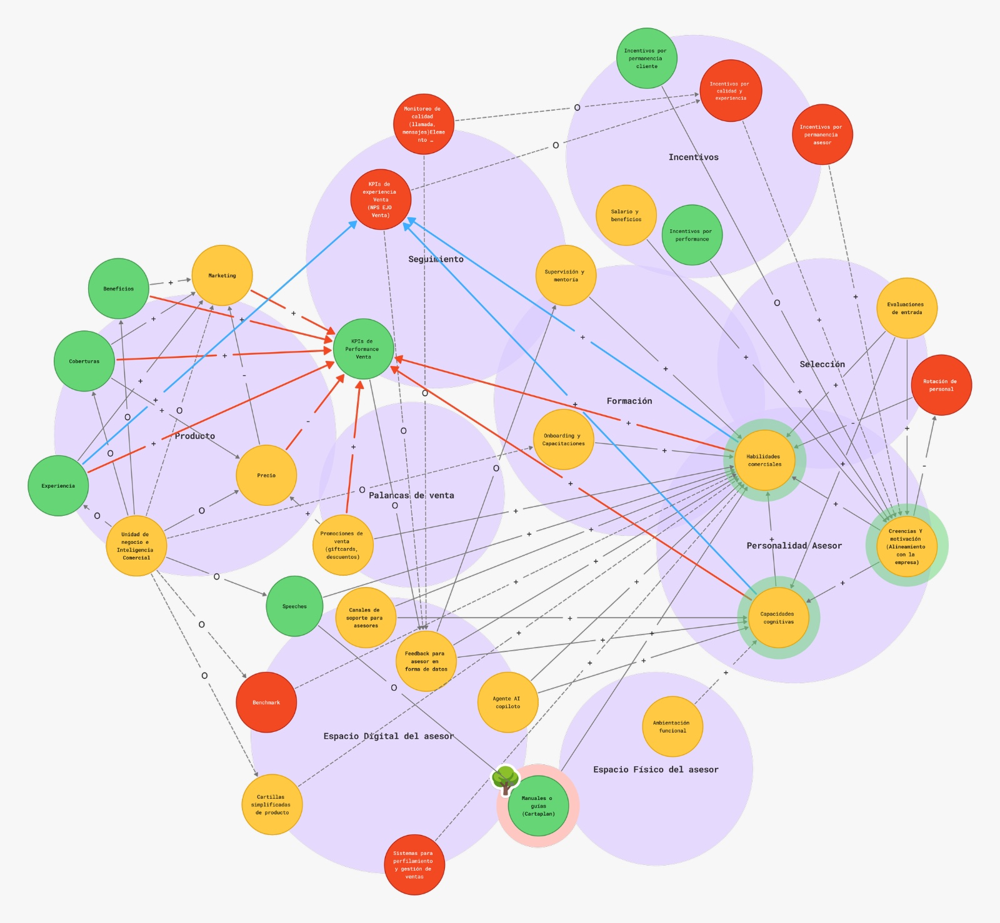

# Back to Basics — Fuerza de Venta Vida Individual

*Behavioral Design · RIMAC · Q3 2026*

*Documento base para construir la presentación a Milagros. Cada sección numerada está pensada
para volverse 1–2 slides; los bloques de cifras están aislados a propósito para que se puedan
convertir directo en gráficos o callouts.*

---

## 1. Resumen ejecutivo

Back to Basics es el frente que unifica las soluciones de comportamiento para la Fuerza de Venta
de Vida Individual (FFVV). Nació de un pedido puntual (speeches), pero la exploración obligatoria
del sistema reveló un problema más grande: el propio equipo trabajaba sin articulación.

| | |
|---|---|
| **Qué ya está construido (Fase 1)** | El modelo de venta (5 bloques) con su agente conversacional, el sistema de perfilamiento por motivaciones, el toolkit de social selling, playbook y materiales, y Universidad Vida |
| **Evidencia que lo respalda** | Encuesta a 19 asesores + taller piloto con NPS 96.67 |
| **Qué falta para cerrar la Fase 1** | El piloto con 10 asesores (día 1 + 2 semanas de campo, arranca 07/08) y la decisión de despliegue que sale de él |
| **Qué viene después** | Entrenamiento continuo, espejo a más canales de Vida, transformación al ramo AMI, y dos mitigaciones concretas al riesgo de CUA |
| **Por qué ahora** | La competencia viene ganando market share en seguros de vida mientras RIMAC no crece |

---

## 2. Origen del proyecto

En un momento en que RIMAC despriorizó varios proyectos estratégicos, las áreas de negocio
siguieron buscando al equipo de Behavioral Design para resolver problemas puntuales — la
necesidad del negocio no se detuvo aunque la prioridad formal sí. Así llegó uno de esos pedidos:
crear speeches para distintos momentos del journey del asesor.

La metodología del equipo es recibir todo pedido y, antes de diseñar nada, hacer
**obligatoriamente una exploración inicial del sistema** en el que está inscrito el problema (ver
§3). Esa exploración reveló varios **dolores sistémicos**. Uno de los más importantes: **el
propio equipo de Behavioral Design venía produciendo diseños y soluciones no articuladas entre
sí** — respuestas puntuales a pedidos puntuales (un speech aquí, una plantilla allá), sin atacar
los problemas estructurales que los originaban ni acumular aprendizaje de un pedido al siguiente.

De ese hallazgo surgió la decisión de **unificar los frentes de Venta Vida** en vez de seguir
respondiendo pedido por pedido, y **Back to Basics** nació como el frente que concentra las
soluciones relacionadas a la FFVV.

## 3. Metodología: explorar el sistema antes de diseñar

Todo pedido que llega al equipo recibe, obligatoriamente, una exploración del sistema en el que
está inscrito el problema — antes de diseñar ninguna solución. No se diseña una pieza suelta sin
entender primero el ecosistema completo que la rodea: qué otras palancas existen, cómo se
conectan, y qué resultados ya está produciendo ese sistema.

El resultado típico de esa exploración es un mapa del ecosistema — ver §5. Esta regla es la razón
por la que Back to Basics existe como frente unificado en vez de como una colección de piezas
sueltas, y es la misma razón por la que este proyecto trae consigo diagnóstico y evidencia
primaria propia, no solo intuición del equipo.

---

## 4. Contexto y problema

**El problema de negocio.** La FFVV de Vida Individual necesita fortalecer tres cosas a la vez:
cómo agenda citas, cómo forma a sus asesores (especialmente a los nuevos) y cómo genera leads de
forma sostenible. Hoy el asesor navega con herramientas dispersas, sin una estrategia de contacto
unificada y sin un modelo de venta consultiva estandarizado — cada quien vende "a su manera", con
curvas de aprendizaje largas para los asesores junior.

**El riesgo legal que lo hace urgente.** Más de la mitad de la venta de Vida Individual nace de
contacto que hoy no tiene opt-in previo. La Ley 32323 (vigente 2025, "ley antispam") prohíbe la
comunicación comercial sin consentimiento previo, expreso e inequívoco, y la fiscalización ya es
activa en el sistema financiero:

| Caso | Sanción |
|---|---|
| Tope legal | Hasta 450 UIT (~S/2.4M) |
| BBVA | Sancionado por una sola llamada |
| Scotiabank | Sancionado por más de S/2.4M |

El componente CUA (gestión del consentimiento) se integró dentro de Back to Basics como parte del
mismo problema, no como iniciativa aparte: no se puede rediseñar la estrategia de contacto sin
resolver primero cómo se contacta de forma legal.

**El problema conductual detrás.** Dos mecanismos explican por qué el asesor no rinde lo que
podría: (1) sobrecarga cognitiva — demasiadas herramientas y materiales sin estructura, lo que
degrada la toma de decisión incluso de un vendedor experimentado; (2) ausencia de un modelo de
formación con práctica espaciada y feedback — el onboarding actual no sostiene el aprendizaje en
el tiempo, así que el ramp-up de un asesor junior es lento y costoso.

**Por qué importa a nivel de negocio.**

| Indicador | Perú | Referencia |
|---|---|---|
| Penetración de seguros (% PBI) | ~2.08% | Chile: 4.6% |
| Tenencia de seguro | ~4 de cada 10 personas | — |
| Desconfianza del seguro | ~48% | Causa #1: falta de información |

El asesor es, en la práctica, el punto de contacto humano que puede revertir esa desconfianza si
tiene la estrategia y las herramientas correctas para hacerlo.

**Por qué es urgente ahora mismo.** La competencia viene ganando market share en el ramo de
seguros de vida mientras RIMAC no crece — revertir esa brecha depende, en gran parte, de que la
fuerza de venta convierta más y mejor con lo que ya tiene, no de esperar una palanca nueva de
producto.

---

## 5. Diagnóstico y resultados

Antes de construir la Fase 1, el equipo se apoyó en tres fuentes de diagnóstico: el mapa completo del
ecosistema (resultado de la exploración obligatoria, §3), una encuesta a los propios asesores, y
los resultados de un taller piloto sobre el dolor #1 que ese diagnóstico detectó. Las tres apuntan
en la misma dirección.

### 5.1 Diagnóstico sistémico: qué reveló el mapa del ecosistema

La exploración obligatoria del sistema (§3) no arrojó una lista plana de palancas — arrojó cuatro
hallazgos que se explican entre sí, y que son el verdadero resultado del diagnóstico. Todo lo demás
que muestra el mapa (9 frentes, decenas de nodos) es contexto de apoyo, no el hallazgo central.

**1 · Sobrecarga del asesor.** Casi todos los frentes del ecosistema —Producto, Selección,
Formación, Incentivos, Seguimiento, Espacio Digital y Espacio Físico— convergen sobre un mismo
punto: las habilidades y capacidades del asesor individual. En el mapa, **Habilidades comerciales**
y **Capacidades cognitivas** son los nodos con más conexiones entrantes de todo el sistema:
onboarding, supervisión y mentoría, evaluaciones de entrada, cuatro tipos distintos de incentivos,
monitoreo de calidad, materiales y hasta el agente de IA copiloto desembocan ahí. El asesor termina
siendo el amortiguador de toda la complejidad del sistema — lo que cada frente no resuelve por su
cuenta, se lo pasa a él, en el momento de la venta.

**2 · Lógicas que colisionan.** Cada frente opera con una lógica propia, y ninguna está diseñada
pensando en las demás. Incentivos combina permanencia, calidad y performance en circuitos de
recompensa distintos y no necesariamente alineados entre sí; Selección filtra en la entrada con
evaluaciones, pero convive con rotación de personal activa; Formación impone un ritmo pedagógico
(onboarding + mentoría) que no está sincronizado con la lógica comercial de Producto y Palancas de
venta (precio, promociones, marketing) ni con la lógica de control de Seguimiento (monitoreo de
calidad, KPIs). El mapa no muestra ningún nodo que traduzca o concilie estas lógicas entre sí — el
único lugar donde todas se encuentran es, otra vez, el asesor (hallazgo 1).

**3 · Experiencia desarticulada de cara al cliente.** La consecuencia de los dos hallazgos
anteriores no se queda en el asesor: se traslada al cliente. Sin una estrategia de contacto y un
modelo de venta unificados, cada asesor termina vendiendo "a su manera" (ver también §4). En el
propio mapa, el nodo que representa el resultado hacia el cliente —**KPIs de experiencia de Venta
(NPS, EJO)**— depende casi enteramente de las Habilidades comerciales y la Experiencia del asesor:
el cliente hereda directamente cualquier inconsistencia que el sistema no resolvió antes de llegar
al asesor. No existe, en el mapa, ninguna palanca dedicada a sostener una experiencia consistente
entre asesores — es un efecto secundario no gestionado de todo lo anterior.

**4 · La queja es sobre el trato, no sobre el consentimiento.** Esto corrige una lectura frecuente
del problema: cuando el cliente se queja, en general no es por un tema de consentimiento formal —
es porque **se sintió acosado o maltratado** en el contacto. El riesgo legal (§4) y la experiencia
del cliente son dos problemas relacionados pero distintos: resolver el consentimiento no resuelve,
por sí solo, el trato.

**Hallazgos secundarios.** El mapa organiza 9 frentes (Producto, Palancas de venta, Formación,
Selección, Incentivos, Personalidad del Asesor, Seguimiento, Espacio Digital del asesor y Espacio
Físico del asesor) — no es un inventario exhaustivo de todas las causas de venta, sino el mapa de
las palancas que el equipo puede accionar y cómo se conectan entre sí. Back to Basics interviene
sobre todo en Personalidad del Asesor, Formación, y una parte de Palancas de venta y Espacio
Digital/Físico del asesor — exactamente donde convergen los cuatro hallazgos centrales.

Uno de los outputs tangibles de esta exploración es el mapa completo — nodos, relaciones causales
(+/−) y agrupación por frente:

### 5.2 Encuesta a asesores sobre herramientas (n=19)

**Uso de herramientas (frecuencia auto-reportada):**

| Herramienta | "Siempre" | "Nunca" | Lectura |
|---|---|---|---|
| Salesforce | 16/19 | 0/19 | Herramienta troncal, uso casi universal |
| WhatsApp | 14/19 | 0/19 | Canal de contacto dominante |
| Email | 11/19 | 0/19 | Uso alto, más variable |
| AIDA | 7/19 | 1/19 | Uso alto, con quejas de calidad (ver abajo) |
| Excel | 10/19 | 1/19 | Varios asesores arman sus propias tablas cuando otra herramienta falla |
| Cartillas de producto | 4/19 | 4/19 | Uso mixto |
| CartaPlan | 1/19 | 7/19 | Adopción baja — mayoría "nunca" o "rara vez" |

**Satisfacción, y por qué el promedio no cuenta toda la historia.** El promedio general es
**8.05/10** — alto en el agregado. Pero convive con fricciones concretas y repetidas en las
respuestas abiertas: la ayuda para que el cliente **entienda el producto** se califica 8/19
"bastante", 8/19 "regular", 3/19 "poco"; la ayuda para **manejar objeciones y persuadir** cae a
6/19 "bastante", 9/19 "regular", 4/19 "poco" — peor calificada que la comprensión de producto.

**El hallazgo más accionable: manejo de objeciones y cierre son el mismo dolor.** "Manejo de
objeciones" es el tema de capacitación más pedido (8/19, 42%, muy por encima de "Conocimiento de
producto" o "Conocimiento de los clientes", 4/19 cada uno), y "el cierre" es el momento de la venta
donde más apoyo se pide (~7–8/19, ~40% de las respuestas abiertas). Lectura conjunta: el asesor no
pide más información de producto — pide ayuda para manejar la conversación en el momento en que el
cliente objeta, justo antes de cerrar. Es un problema de habilidad conversacional, no de
conocimiento declarativo.

**Herramienta que más se pide mejorar (empate a 4/19 cada una):**
- **AIDA** — con motivo explícito y repetido: *"no da la información adecuada y se equivoca con
  otro producto"*, *"no brinda información correcta"*, *"no contesta bien casi nunca"*.
- **Recursos visuales** (cartillas, flyers) — piden brochures digitales y plantillas listas; varios
  mencionan que hoy tienen que crear sus propios materiales.
- **Cotizador** — piden poder usarlo sin registro/autorización previa y con más ejemplos.

**Otros hallazgos:** un asesor señala una falla de onboarding explícita — *"no enseñan bien a usar
el salesforce en las capacitaciones del inicio... tenemos que aprender en marcha"*; varios asesores
mencionan usar ChatGPT o Gemini de forma no oficial para compensar huecos de AIDA o del cotizador —
la necesidad ya se resuelve informalmente cuando la herramienta oficial no alcanza.

### 5.3 Taller de Manejo de Objeciones — resultados del piloto

Taller para fortalecer las capacidades de gestión de objeciones en la interacción con clientes,
reportado por CoE Experience Design:

| Indicador | Resultado |
|---|---|
| Satisfacción con el contenido | **99.33%** |
| Desempeño del speaker | **98.67%** |
| NPS (recomendación) | **96.67** |
| Asistencia | 83.33% (30 de 36 invitados) |

**Qué generó el valor (drivers, en orden):**
1. **Casuística real** — el principal driver de valor; facilita la aplicación directa en la
   gestión con clientes.
2. **Copiloto de IA** — potencia la calidad de las respuestas y la creatividad en el manejo de
   objeciones. El mecanismo (role-play + feedback + puntaje) coincide con el simulador de IA que
   el equipo co-diseñó para práctica deliberada (ver §6) — es probable que sea la misma
   herramienta en su primera corrida real, aunque el taller lo organizó CoE Experience Design.
3. **Metodología práctica y dinámica** — interacción, práctica y feedback fortalecen habilidades
   críticas del rol.

**Oportunidades de mejora identificadas:**
1. Ampliar la práctica y diversidad de casos: incorporar role play, videos y más escenarios.
2. Ajustar el uso del copiloto de IA: mejorar la consistencia de las evaluaciones y el
   alineamiento con lineamientos internos — **el mismo problema de calidad de información que ya
   reportan los asesores sobre AIDA en la encuesta** (§5.2): dos fuentes independientes apuntando
   al mismo defecto concreto.
3. Optimizar logística: duración, horarios y espacios dedicados a práctica.

### 5.4 Lectura conjunta del diagnóstico

El dolor específico que reportan la encuesta y el taller —manejo de objeciones, justo en el
cierre— es la expresión más concreta del hallazgo 1 del diagnóstico sistémico (§5.1): es el
momento de máxima sobrecarga para el asesor, donde todas las lógicas del sistema (incentivo,
presión de cierre, guion de producto) tienen que resolverse en tiempo real y sin apoyo. El tema
(manejo de objeciones), el momento (cierre) y el mecanismo (simulación con IA + feedback) coinciden
en el mapa del ecosistema, en la encuesta y en el taller — tres señales independientes apuntando en
la misma dirección.

Pero el diagnóstico completo pide algo más amplio que solo entrenamiento. Si las lógicas del
sistema colisionan (hallazgo 2) y la experiencia del cliente se desarticula porque hereda esa
inconsistencia —sintiéndose además mal tratado, no solo mal informado (hallazgos 3 y 4)—, la
respuesta no puede ser una sola pieza: tiene que ser contenido y herramientas que, entre ellos,
hablen el mismo idioma. Y si tanto la encuesta como el taller señalan, de forma independiente, el
mismo defecto de calidad en el copiloto de IA (§5.2, §5.3), corregir esa falla deja de ser un
detalle de mantenimiento y pasa a ser condición para que cualquier otra apuesta funcione.

**Crear contenido y herramientas que hablen el mismo idioma, corregir las fallas del copiloto y
evolucionar el entrenamiento con IA son las apuestas mejor respaldadas del backlog, y son la base
de la Fase 1 (§6).**

---

## 6. Qué se construyó

La Fase 1 del proyecto es un modelo de venta completo, no piezas sueltas de comunicación — la
respuesta a que el contenido y las herramientas hablen el mismo idioma (§5.4). Esto es lo que
existe hoy, construido:

**El Modelo de Experiencia de Venta Vida, en 5 bloques.** Quiénes somos · Qué vendes · Que te
encuentren · **La asesoría** · Después del sí. La asesoría es el corazón del modelo: un recorrido
de 4 pasos donde el asesor descubre la motivación del cliente antes de hablar de producto,
dimensiona un número concreto —no un precio suelto— y cierra pidiendo un siguiente paso. Es una
secuencia evaluable, no una colección de técnicas sueltas.

**El sistema de perfilamiento por motivaciones**, con dos mecánicas de dimensionamiento distintas
según lo que mueve al cliente: **meta** (el número sale del costo de lo que quiere lograr — p. ej.
una carrera universitaria) y **protección** (el número sale del ingreso que la familia dejaría de
percibir). Son dos razonamientos distintos, no una sola fórmula — y alimentan el resto de
materiales (statement de vida, pitch, storytelling).

**El agente conversacional — la superficie de uso real del asesor.** El asesor no busca el
playbook en un documento: el agente es la base de conocimiento que alimenta la conversación, con
el portafolio de producto, las nueve objeciones documentadas y los speeches (que cambian según el
origen del lead) disponibles en dos modos de uso. El PDF del playbook existe como respaldo y
entregable de implementación, no como la herramienta de uso diario. Es probable que sea la misma
línea de desarrollo que el copiloto de IA usado en el taller de manejo de objeciones (§5.3), ahora
aplicado al flujo completo de venta y no solo al entrenamiento — pendiente de confirmar con el
equipo.

**Toolkit de social selling, en dos niveles.** Nivel 1 — lo que se resuelve en el momento: foto
profesional, historia profesional en 3 partes (quién soy · por qué elegí esto/a quién ayudo · cómo
puedo ayudarte hoy), perfiles y firma de correo actualizados. Nivel 2 — lo que se completa después
con apoyo del agente: actualización completa de redes y banco de contenido para repostear.

**Playbook de storytelling y materiales de venta** — encuadre narrativo para donde la cifra sola no
persuade, más materiales simplificados (flyer, brochure, cartaplan) que reducen la carga cognitiva
del mensaje.

**Estrategia de contacto** validada en conjunto con Legal, Cumplimiento y CUA — informe de primer
contacto y plantillas de WhatsApp/correo para el flujo con consentimiento (la versión sin
consentimiento está en construcción) — construida sobre desk research, shadowing, entrevistas,
cliente incógnito y seis sacrificial concepts.

**Universidad Vida** — onboarding con práctica espaciada desde el día 1, y un modelo de
competencias por niveles para sostener la motivación del asesor más allá del arranque.

---

## 7. Piloto y despliegue

Antes del despliegue completo, el modelo se valida con datos reales de campo: un piloto de dos
fases con 10 asesores en operación.

### Objetivo y diseño
Validar si el asesor comprende el modelo, lo aplica como fue diseñado, y lo incorpora a su forma
de trabajar a través del agente — y qué le falta al modelo para sostenerse cuando se implemente.
No es un experimento comercial: en dos semanas no se espera (ni se busca) movimiento en tasa de
cierre; lo que se valida es recepción, aplicación y adopción.

- **Día 1 — Transferencia** (sesión de 90 min): estructura del modelo, La asesoría en profundidad,
  social selling en acción (se hace, no se explica), entrega de accesos al agente, y un ejercicio
  de comprensión con 4 casos escritos.
- **Campo — Puesta en acción** (2 semanas): el asesor trabaja con el agente en interacciones
  reales; se mide con shadowing por cobertura, bitácora post-conversación (30 seg) y tracking
  automático de uso — casi nada se le pregunta directamente al asesor.
- **Cierre — 2da calibración**: mismo ejercicio de comprensión (para medir el delta), valoración
  del agente, consolidación de hallazgos y decisión sobre implementación en AIDA.

### Muestra: 10 asesores
Compuesta a propósito por antigüedad, territorio y forma de originar demanda — no para comparar
rendimiento entre grupos, sino para detectar si el modelo asume condiciones que no todos los
asesores tienen: 6 Lima / 2 Arequipa / 2 Cuzco-Trujillo; 4 de 6 meses / 4 de 2–3 años / 2 perfiles
particulares (asesor diamante, generador de contenido en redes).

### Qué decide este piloto
1. Si el modelo se implementa en AIDA, y bajo qué condiciones.
2. Qué contenido falta cerrar antes del rollout, priorizado por demanda real (no por supuesto).
3. Cómo se lanza — si el modelo se sostiene solo o necesita acompañamiento, y si eso cambia según
   el perfil del asesor.
4. Qué ajustar del modelo mismo.

### Hitos comprometidos
| Fecha | Hito |
|---|---|
| Vie 24/07 | Envío de playbook y artefactos · selección de asesores |
| Mar 04/08 | Revisión de playbook y artefactos con Líderes de Venta y Producto |
| Vie 07/08 | Inicio del piloto |

### Despliegue (post-piloto)
Con el piloto validado, la estrategia de adopción cubre dos frentes — la fuerza de venta actual
(defaults, recordatorios, campeones internos) y Universidad Vida (adopción por cohortes con hitos
visibles y reconocimiento) — para que las nuevas prácticas se sostengan más allá del lanzamiento.
La decisión de implementación en AIDA es, en sí misma, una salida directa del piloto (arriba), no
un paso posterior independiente.

**Impacto esperado:** ↓ curva de aprendizaje y +conversión de venta; −25–40% en tiempo de ramp-up
de asesores junior (estimado); +20–30% en agendamiento de citas (estimado); ahorro proyectado de
S/1.8M vía AIDA.

---

## 8. Siguientes pasos

### 8.1 Evolución del entrenamiento

**Corto plazo:** resolver la consistencia de las respuestas del copiloto de IA que ya señalan
tanto la encuesta como el taller (§5) — sin eso, escalar el entrenamiento con IA solo escala el
mismo defecto.

**Mediano plazo:** pasar de un onboarding puntual a un **programa de crecimiento continuo**:
modelo por competencias + calendarización con práctica espaciada + desarrollo del asesor más allá
del primer mes. La práctica espaciada supera consistentemente a la práctica masiva en retención de
aprendizaje — este paso extiende esa misma lógica del onboarding al desarrollo de mediano plazo.

En paralelo, evolucionar el **entrenamiento con IA de piloto a herramienta funcional** de uso
diario para el asesor (no solo para el taller) — requiere una reunión con el equipo de GenAI que
defina alcances conjuntos.

### 8.2 Adaptación a otros canales de venta Vida — estrategia de espejo

Mismo producto (Vida), mismo cliente, mismo modelo de venta — lo único que cambia es el canal de
entrega. Por eso es una **estrategia de espejo**: replicar lo ya validado, no rediseñarlo.

- **Se replica sin cambios:** el modelo de venta consultiva, el playbook de storytelling, la
  estrategia de contacto validada con Legal/Cumplimiento/CUA, y el sistema de perfilamiento por
  motivaciones (§6).
- **Se ajusta por canal:** el canal de contacto en sí (WhatsApp/correo vs. el canal nuevo), el
  ritmo de seguimiento y, si aplica, el tono del mensaje.
- **Riesgo y esfuerzo:** bajo — no requiere repetir la exploración del sistema (§3), porque el
  mapa que ya se hizo (§5.1) es el de Vida Individual, no el del canal.

### 8.3 Adaptación a otro ramo: AMI — estrategia de transformación

Producto distinto, cliente con otras motivaciones de compra, otro ciclo de venta y otras
objeciones típicas — por eso esto es una **estrategia de transformación**, no una copia. Antes de
construir una Fase 1 para AMI hay que repetir la exploración obligatoria del sistema (§3) para ese
ramo: el mapa del ecosistema de Vida (§5.1) no es válido para AMI.

- **Se hereda:** la metodología completa (exploración de sistema → diagnóstico → Fase 1 con
  evidencia propia), el enfoque de formación con práctica espaciada, y el modelo de validación por
  piloto (§7).
- **Se transforma:** la arquitectura de decisión (qué preguntas anclan la oferta), el manejo de
  objeciones específico de AMI, y el sistema de perfilamiento por motivaciones — que necesita
  recalibrarse para el comprador de AMI, no reusarse tal cual.
- **Riesgo y esfuerzo:** mayor — requiere diagnóstico propio antes de poder construir nada.

Esto es distinto del proyecto de guías resumidas de AMI Relanzamiento (que resuelve entendimiento
de producto, no modelo de venta) — aquí se trata de transformar el *modelo de venta* que Back to
Basics validó en Vida, no replicar piezas de comunicación de un producto específico.

### 8.4 Estrategias para mitigar el golpe de CUA

Dos frentes concretos, pensados para trabajar en conjunto:

**Alertas de CRM.** Arquitectura de fricción deliberada: avisar al asesor si el cliente pidió no
ser contactado, o condicionar directamente el contacto a tener el consentimiento registrado —
un default seguro dentro del CRM que protege a RIMAC del riesgo legal sin depender de que el
asesor recuerde revisarlo. Requiere coordinación con el equipo dueño del CRM.

**Programa de referidos.** En vez de contactar en frío, activar el contacto por **referido de un
cliente existente**: la introducción cálida trae consigo un consentimiento implícito y evita por
completo el riesgo de contacto no autorizado — no es solo una mitigación legal, también convierte
mejor que el contacto en frío por dos mecanismos conductuales conocidos: prueba social (el cliente
existente ya validó el producto) y reciprocidad (referir es un favor que el asesor puede
reconocer). Queda por definir la mecánica de incentivo para el cliente que refiere.

---

## 9. Equipo y modalidad

- **Modalidad:** Perform — parte del 80% de iniciativas ya priorizadas por el comité (no es una
  apuesta de Transform).
- **Equipo del frente:** Melissa y Alejandro, junto con César (Lead de Service Design, de otro
  equipo).

---

## 10. Cierre para la conversación con Milagros

| | |
|---|---|
| **Cómo nació** | De un pedido puntual (speeches), tras la exploración obligatoria del sistema se detectó que el propio equipo trabajaba sin articulación — de ahí la unificación en Back to Basics |
| **Qué muestra el diagnóstico** | Sobrecarga del asesor, lógicas de sistema que colisionan, experiencia desarticulada de cara al cliente, y que la queja es sobre el trato — no sobre el consentimiento — confirmado por el mapa del ecosistema, la encuesta a 19 asesores y el taller piloto (NPS 96.67), que además apuntan al mismo dolor concreto: manejo de objeciones en el cierre |
| **Qué ya está construido** | El modelo de venta (5 bloques) con su agente conversacional, el sistema de perfilamiento por motivaciones, el toolkit de social selling, playbook y materiales, y Universidad Vida — validados con ese diagnóstico y con Legal/Cumplimiento/CUA |
| **Qué falta para cerrar la Fase 1** | El piloto con 10 asesores (día 1 + 2 semanas de campo, arranca 07/08) y la decisión de despliegue que sale de él |
| **Qué viene después** | Entrenamiento continuo, espejo a más canales de Vida, transformación al ramo AMI, y dos mitigaciones concretas al riesgo de CUA |
| **Por qué ahora** | La competencia viene ganando market share en seguros de vida mientras RIMAC no crece |
